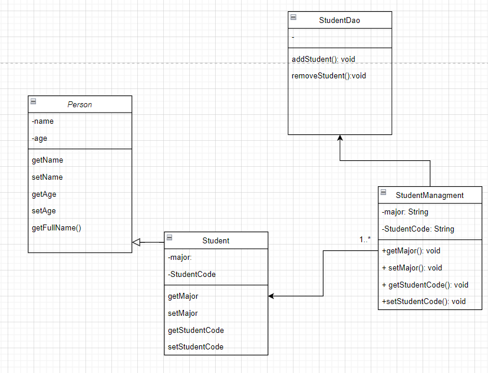

## OOP
### Tính đóng gói(Encapsulation)
- Đóng gói là đặt tất cả các biến, phương thức trong một Lớp(Class)
Cho phép ẩn các dữ liệu "nhạy cảm" khỏi người dùng. Ta cần khai báo biến, thuộc tính có kiểu là private và cung cấp các methods: get, set để truy cập, cập nhật dữ liệu.
- Các thuộc tính name, age, major, studentCode được khai báo là private Giúp che giấu thông tin đối tượng và chỉ cho phép truy cập qua các phương thức getter, setter.
### Tính kế thừa (Inheritance)
-Tính kế thừa cho phép xây dựng một lớp mới (lớp Con), kế thừa và tái sử dụng các thuộc tính, phương thức dựa trên lớp cũ (lớp Cha) đã có trước đó. 
- Chương trình có lớp Student kế thừa từ lớp Person
###  Tính đa hình (Polymorphism)
-Tính đa hình trong lập trình OOP cho phép các đối tượng khác nhau thực thi chức năng giống nhau theo những cách khác nhau.
-Phương thức getFullname() trong lớp Person dùng để lấy toàn bộ Họ và tên. Phương thức này được ghi đè trong lớp với các thuộc tính khác nhau.
### Tính trừu tượng (Abstraction)
-Person là lớp trừu tượng chứa phương thức trừu tượng getFullname().
### UML

### Các khái niệm
-Interface: là một lớp trừu trượng ,tập hợp các phương thức trừu tượng và hằng số được sử dụng để định nghĩa hành vi chung cho một nhóm các lớp. Để truy cập các phương thức trong interface thì Interface cần được implements bởi các lớp khác
- Static
    + Biến tĩnh thuộc về một lớp chứ không thuộc về một đối tượng cụ thể của lớp đó. Biến tĩnh được chia sẻ bởi tất cả các đối tượng của lớp.
    + Phương thức tĩnh thuộc về một lớp chứ không thuộc về một đối tượng cụ thể của lớp đó. Phương thức tĩnh có thể được gọi mà không cần tạo đối tượng của lớp.
    