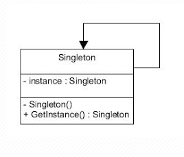
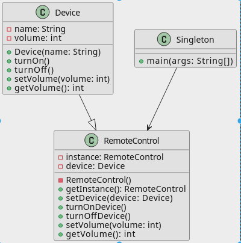
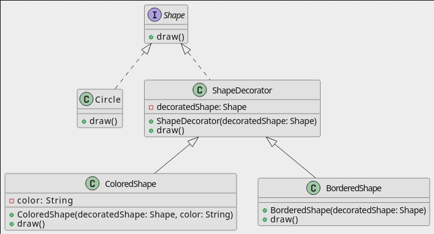
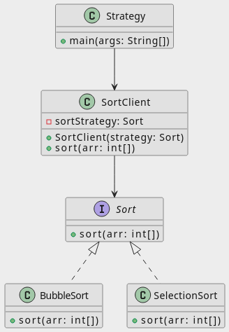

## 1.Collection(s)
### 1.1 HashMap, HashSet, ArrayList

|                         | **HashMap**                                                                                                                                                                                                                                                                                                                                                                                                                                                                                                                                                                                                                                                                                                                                                               | **HashSet**                                                                                                                                                                                                                                                                                                                                                                                                        | **ArrayList**                                                                                                                                                                                                                                                                                                                                                                                                                                                                                                                                                                                                                                                                                                                                                         |
|-------------------------|---------------------------------------------------------------------------------------------------------------------------------------------------------------------------------------------------------------------------------------------------------------------------------------------------------------------------------------------------------------------------------------------------------------------------------------------------------------------------------------------------------------------------------------------------------------------------------------------------------------------------------------------------------------------------------------------------------------------------------------------------------------------------|--------------------------------------------------------------------------------------------------------------------------------------------------------------------------------------------------------------------------------------------------------------------------------------------------------------------------------------------------------------------------------------------------------------------|-----------------------------------------------------------------------------------------------------------------------------------------------------------------------------------------------------------------------------------------------------------------------------------------------------------------------------------------------------------------------------------------------------------------------------------------------------------------------------------------------------------------------------------------------------------------------------------------------------------------------------------------------------------------------------------------------------------------------------------------------------------------------|
|                         | lưu trữ dữ liệu dưới dạng cặp khóa-giá trị (key-value)                                                                                                                                                                                                                                                                                                                                                                                                                                                                                                                                                                                                                                                                                                                    | lưu trữ dữ liệu dưới dạng các đối tượng (object)                                                                                                                                                                                                                                                                                                                                                                   | lưu trữ dữ liệu dưới dạng các đối tượng (object)                                                                                                                                                                                                                                                                                                                                                                                                                                                                                                                                                                                                                                                                                                                      |
| **Interface**           | Map                                                                                                                                                                                                                                                                                                                                                                                                                                                                                                                                                                                                                                                                                                                                                                       | Set                                                                                                                                                                                                                                                                                                                                                                                                                | List                                                                                                                                                                                                                                                                                                                                                                                                                                                                                                                                                                                                                                                                                                                                                                  |
| **Cho phép trùng lặp**  | HashMap không cho phép các khóa (key) trùng lặp, nhưng cho phép các giá trị (value) trùng lặp.                                                                                                                                                                                                                                                                                                                                                                                                                                                                                                                                                                                                                                                                            | Không (các phần tử là duy nhất)                                                                                                                                                                                                                                                                                                                                                                                    | Có (cho phép các phần tử trùng lặp)                                                                                                                                                                                                                                                                                                                                                                                                                                                                                                                                                                                                                                                                                                                                   |
| **Thứ tự**              | Không theo thứ tự thêm vào                                                                                                                                                                                                                                                                                                                                                                                                                                                                                                                                                                                                                                                                                                                                                | Không theo thứ tự thêm vào                                                                                                                                                                                                                                                                                                                                                                                         | Theo thứ tự thêm vào                                                                                                                                                                                                                                                                                                                                                                                                                                                                                                                                                                                                                                                                                                                                                  |
| **Truy cập phần tử**    | Theo key (sử dụng phương thức get(key))                                                                                                                                                                                                                                                                                                                                                                                                                                                                                                                                                                                                                                                                                                                                   | Kiểm tra tồn tại (contains(object))                                                                                                                                                                                                                                                                                                                                                                                | Theo index (sử dụng phương thức get(index))                                                                                                                                                                                                                                                                                                                                                                                                                                                                                                                                                                                                                                                                                                                           |
| **Thêm/Xóa phần tử**    | put(key, value), remove(key)                                                                                                                                                                                                                                                                                                                                                                                                                                                                                                                                                                                                                                                                                                                                              | add(object), remove(object)                                                                                                                                                                                                                                                                                                                                                                                        | add(object), remove(object), remove(index)                                                                                                                                                                                                                                                                                                                                                                                                                                                                                                                                                                                                                                                                                                                            |
| **Hiệu quả**            | Nhanh khi truy cập theo key                                                                                                                                                                                                                                                                                                                                                                                                                                                                                                                                                                                                                                                                                                                                               | Nhanh khi kiểm tra tồn tại                                                                                                                                                                                                                                                                                                                                                                                         | Nhanh khi truy cập theo index                                                                                                                                                                                                                                                                                                                                                                                                                                                                                                                                                                                                                                                                                                                                         |
| **Sử dụng cho**         | Lưu trữ key-value (associazione)                                                                                                                                                                                                                                                                                                                                                                                                                                                                                                                                                                                                                                                                                                                                          | Lưu trữ các phần tử duy nhất                                                                                                                                                                                                                                                                                                                                                                                       | Lưu trữ danh sách các phần tử có thứ tự                                                                                                                                                                                                                                                                                                                                                                                                                                                                                                                                                                                                                                                                                                                               |
| **Phương thức sử dụng** | put(key, value): Thêm một cặp khóa-giá trị mới vào HashMap. Nếu khóa đã tồn tại, giá trị cũ sẽ bị ghi đè. get(key): Lấy giá trị được liên kết với khóa đã cho. Nếu khóa không tồn tại, nó sẽ trả về null containsKey(key): Kiểm tra xem khóa đã cho có tồn tại trong HashMap hay không. containsValue(value): Kiểm tra xem giá trị đã cho có tồn tại trong HashMap hay không. remove(key): Xóa cặp khóa-giá trị có khóa đã cho khỏi HashMap. size(): Trả về số lượng cặp khóa-giá trị trong HashMap. isEmpty(): Kiểm tra xem HashMap có rỗng hay không. keySet(): Trả về một tập hợp chứa tất cả các khóa trong HashMap. values(): Trả về một tập hợp chứa tất cả các giá trị trong HashMap. entrySet(): Trả về một tập hợp chứa tất cả các cặp khóa-giá trị trong HashMap. | add(element): Thêm một phần tử mới vào HashSet. Nếu phần tử đã tồn tại,  nó sẽ không được thêm nữa. contains(element): Kiểm tra xem phần tử đã cho có tồn tại trong HashSet hay không. remove(element): Xóa phần tử đã cho khỏi HashSet. size(): Trả về số lượng phần tử trong HashSet. isEmpty(): Kiểm tra xem HashSet có rỗng hay không. iterator(): Trả về một trình lặp để duyệt qua các phần tử trong HashSet | dd(element): Thêm một phần tử mới vào cuối danh sách. get(index): Lấy phần tử tại vị trí đã cho trong danh sách. set(index, element): Cập nhật phần tử tại vị trí đã cho trong danh sách với giá trị mới. remove(index): Xóa phần tử tại vị trí đã cho khỏi danh sách. size(): Trả về số lượng phần tử trong danh sách. isEmpty(): Kiểm tra xem danh sách có rỗng hay không. contains(element): Kiểm tra xem phần tử đã cho có tồn tại trong danh sách hay không. indexOf(element): Trả về vị trí đầu tiên của phần tử đã cho trong danh sách,  hoặc -1 nếu không tìm thấy. lastIndexOf(element): Trả về vị trí cuối cùng của phần tử đã cho trong danh sách,  hoặc -1 nếu không tìm thấy. iterator(): Trả về một trình lặp để duyệt qua các phần tử trong danh sách. |

### 1.2 hashCode, equals
Ví dụ về sử dụng `hashCode()`, `equal()`. Chương trình tạo một lớp Person để lưu trữ thông tin về một người với các thuộc tính name và age. Tạo một HashSet có tên people để lưu trữ các đối tượng Person.

Lớp Person ghi đè các phương thức equals và hashCode để so sánh hai đối tượng Person dựa trên tên và tuổi của chúng.

hashCode được sử dụng để tính toán vị trí lưu trữ của đối tượng trong bảng băm của HashSet
```
public int hashCode() {
     return Objects.hash(name, age);
}
```
equals được sử dụng để so sánh hai đối tượng xem chúng có bằng nhau hay không.
```    
public boolean equals(Object o) {
      if (this == o) return true;
        if (o == null || getClass() != o.getClass()) return false;
        Person person = (Person) o;
        return name.equals(person.name) && age == person.age;
    }
```
Nếu chúng ta comment lại phương thức `hashCode()` hoặc `equal()` rồi chạy lại chương trình thì kết quả trong hashSet Person chứa 4 phần tử, có hai phần tử  Alice, 30 trùng nhau. Không đảm bảo tính chất của hashSet

Nếu chúng ta chạy chương trình ghi đè đầy đủ phương thức `hashCode()`, `equal()` thì trong hashSet Person chỉ chứa 3 phần tử khác nhau.

## 2. Design Pattern
### 2.1 Singleton
Singleton đảm bảo chỉ duy nhất một thể hiện (instance) được tạo ra và nó sẽ cung cấp cho bạn một method để có thể truy xuất được thể hiện duy nhất đó mọi lúc mọi nơi trong chương trình

Sử dụng Singleton khi chúng ta muốn:
- Đảm bảo rằng chỉ có một instance của lớp.
- Việc quản lý việc truy cập tốt hơn vì chỉ có một thể hiện duy nhất.
- Có thể quản lý số lượng thể hiện của một lớp trong giớn hạn chỉ định.

### 2.2 Decoratorg
Decorator pattern là một trong những Pattern thuộc nhóm cấu trúc (Structural Pattern). Nó cho phép người dùng thêm chức năng mới vào đối tượng hiện tại mà không muốn ảnh hưởng đến các đối tượng khác. Kiểu thiết kế này có cấu trúc hoạt động như một lớp bao bọc (wrap) cho lớp hiện có. Mỗi khi cần thêm tính năng mới, đối tượng hiện có được wrap trong một đối tượng mới (decorator class).
Decorator pattern sử dụng composition thay vì inheritance (thừa kế) để mở rộng đối tượng.

### 2.3 Strategy
Strategy Pattern là một trong những Pattern thuộc nhóm hành vi (Behavior Pattern). Nó cho phép định nghĩa tập hợp các thuật toán, đóng gói từng thuật toán lại, và dễ dàng thay đổi linh hoạt các thuật toán bên trong object. Strategy cho phép thuật toán biến đổi độc lập khi người dùng sử dụng chúng.
Strategy Pattern giúp tách rời phần xử lý một chức năng cụ thể ra khỏi đối tượng. Sau đó tạo ra một tập hợp các thuật toán để xử lý chức năng đó và lựa chọn thuật toán nào mà chúng ta thấy đúng đắn nhất khi thực thi chương trình. Mẫu thiết kế này thường được sử dụng để thay thế cho sự kế thừa, khi muốn chấm dứt việc theo dõi và chỉnh sửa một chức năng qua nhiều lớp con.

## 3.Senalize
Serialization là quá trình chuyển đổi trạng thái của một đối tượng Java thành một luồng byte, cho phép lưu trữ đối tượng ở bất kỳ đâu và sử dụng bởi một tiến trình khác. Quá trình ngược lại gọi là deserialization, nơi luồng byte được chuyển đổi trở lại thành đối tượng Java.

Quan hệ IS-A và HAS-A:
- IS-A: Nếu một lớp implement giao diện Serializable, tất cả các lớp con của nó cũng sẽ được serializable.
- HAS-A: Nếu một lớp có tham chiếu đến một lớp khác, thì cả hai lớp đều cần implement giao diện Serializable.

Để thực hiện serialization, lớp của bạn cần implements giao diện java.io.Serializable. Giao diện này không có phương thức nào, nó chỉ đóng vai trò là một marker để cho JVM biết rằng lớp có thể được serialize.
```
class Person implements Serializable {
....
}
```
Để serialize một đối tượng:
- Tạo một đối tượng ObjectOutputStream.
- Gọi phương thức writeObject() của ObjectOutputStream và truyền đối tượng cần serialize vào.
- Đóng ObjectOutputStream.
```
try (FileOutputStream fos = new FileOutputStream("person.dat");
             ObjectOutputStream oos = new ObjectOutputStream(fos)) {
            Person person = new Person("John Doe", 30);
            oos.writeObject(person);
        } catch (IOException e) {
            e.printStackTrace();
        }
```

Để deserialize một đối tượng:
- Tạo một đối tượng ObjectInputStream.
- Gọi phương thức readObject() của ObjectInputStream để lấy đối tượng đã được serialize.
- Đóng ObjectInputStream
```
try (FileInputStream fis = new FileInputStream("person.dat");
     ObjectInputStream ois = new ObjectInputStream(fis)) {
  Person person = (Person) ois.readObject();
  System.out.println(person.getName() + ", " + person.getAge());
} catch (IOException | ClassNotFoundException e) {
  e.printStackTrace();
}
```

