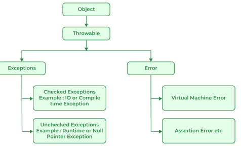
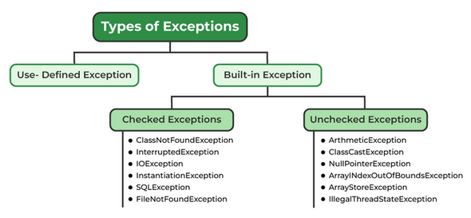
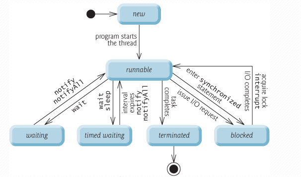

## 1.Exception
Exception là một sự kiện xảy ra trong quá trình thực thi một chương trình Java, nó làm phá vỡ cái flow (luồng xử lý) bình thường của một chương trình, thậm chí chết chương trình.

Các lý do xảy ra Exception
- Người dùng nhập dữ liệu không hợp lệ
- Truy cập ngoài chỉ số mảng.
- Mất kết nối mạng
- Một file cần được mở nhưng không thể tìm thấy.
- Out-of-disk memory

Error(lỗi) thể hiện cho các trường hợp không thể khắc phục như JVM hết bộ nhớ, tràn bộ nhớ, stack over flow, v.v
Có 2 loại exception: checked và unchecked. Tất cả các checked exception được kế thừa từ lớp Exception ngoại trừ lớp RuntimeException. RuntimeException là lớp cơ sở của tất cả các lớp unchecked exception. 

### Checked exceptions
Là loại exception xảy ra trong lúc compile time, nó cũng có thể được gọi là compile time exceptions. Loại exception này không thể bỏ qua được trong quá trình compile, bắt buộc ta phải handle nó.
Ví dụ:
```
try {
            FileReader file = new FileReader("myfile.txt");
            int data = file.read();
            while (data != -1) {
                System.out.print((char) data);
                data = file.read();
            }
            file.close();
        } catch (FileNotFoundException e) {
            System.out.println("File không được tìm thấy!");
        } catch (IOException e) {
            System.out.println("Lỗi khi đọc file!");
        }
```
phương thức FileReader() có thể ném ra ngoại lệ FileNotFoundException nếu file không được tìm thấy, hoặc IOException nếu có lỗi xảy ra khi đọc file.
### UnChecked exceptions

Là loại exception xảy ra tại thời điểm thực thi chương trình, nó cũng có thể gọi là runtime exceptions đó là programming bugs, lỗi logic của chương trình… Loại exception này được bỏ qua trong quá trình compile, không bắt buộc ta phải handle nó
Ví dụ:
```
int[] myNumbers = {1, 2, 3};
    System.out.println(myNumbers[10]);
```
`Exception in thread "main" java.lang.ArrayIndexOutOfBoundsException: Index 10 out of bounds for length 3 at exceptionExample.main(exceptionExample.java:4)`
Xử lý try catch
```
int[] myNumbers = {1, 2, 3};
try {
      System.out.println(myNumbers[10]);
    } catch (Exception e) {
      System.out.println("Something went wrong.");
    }
  }
```
## 2. Concurrency
### Thread
Luồng (thread) trong Java là một đơn vị xử lý độc lập trong chương trình, cho phép thực hiện đa luồng (multithreading) để cải thiện hiệu suất và tận dụng tối đa tài nguyên máy tính. Mỗi luồng là một dòng thực thi độc lập trong chương trình, có thể chạy song song với các luồng khác

- New

Khi một Thread mới được khởi tạo nhưng chưa bắt đầu chạy, nó ở trạng thái “New”. Ở trạng thái này, Thread chưa được liên kết với hệ thống phân bổ tài nguyên, và chưa được đưa vào hàng đợi CPU. Để bắt đầu chạy một luồng mới, bạn cần gọi phương thức start() của Thread đó.
```
Thread myThread = new Thread(new Runnable() {

@Override

public void run() {

System.out.println(“Thread đang chạy”);

}

});

```
- Runnable

Khi một Thread đã được khởi động bằng phương thức start(), nó chuyển sang trạng thái “Runnable”. Ở trạng thái này, Thread đang chờ đợi CPU để thực thi mã của nó. Trạng thái Runnable không đảm bảo rằng Thread đang thực sự chạy, mà chỉ đơn giản là nó đã sẵn sàng để thực thi và đang chờ đợi tài nguyên.
`myThread.start();`

-Waiting

Trong quá trình hoạt động, một Thread có thể phải chờ một điều kiện nào đó để tiếp tục. Ví dụ, Thread có thể chờ một Thread khác hoàn thành công việc, hoặc chờ một tài nguyên được giải phóng. Khi một Thread ở trạng thái “Waiting”, nó không thực thi mã của nó và giải phóng tài nguyên CPU để các Thread khác có thể sử dụng.

Bạn có thể sử dụng các phương thức như wait(), join(), hoặc LockSupport.park() để đưa một Thread vào trạng thái Waiting.
```
Thread anotherThread = new Thread(new Runnable() {

@Override

public void run() {

System.out.println(“Thread khác đang chạy”);

}

});

myThread.join(); // Chờ anotherThread hoàn thành
```
- Sleeping

Trạng thái “Sleeping” là khi một Thread đang ngủ trong một khoảng thời gian xác định, sau đó tự động chuyển sang trạng thái Runnable. Khi một Thread ở trạng thái Sleeping, nó không thực thi mã của nó và giải phóng tài nguyên CPU.

Để đưa một luồng vào trạng thái Sleeping, bạn có thể sử dụng phương thức sleep().
```
try {

Thread.sleep(1000); // Ngủ trong 1 giây

} catch (InterruptedException e) {

e.printStackTrace();

}

```
- Terminated

Khi một luồng hoàn thành công việc của nó hoặc bị dừng bởi một lý do nào đó, nó chuyển sang trạng thái “Terminated”. Khi một Thread ở trạng thái này, nó không thể tái sử dụng, và bạn cần tạo một Thread mới nếu muốn thực hiện lại công việc đó.

Một số lý do dẫn đến trạng thái Terminated:
- Mã trong phương thức run() của Thread đã hoàn thành.
- Thread gặp phải một ngoại lệ không được xử lý trong phương thức run().
- Phương thức stop() được gọi để dừng Thread (lưu ý: phương thức này đã bị loại bỏ và không nên sử dụng).

```
@Override

public void run() {

System.out.println(“Thread đang chạy”);

// Mã ở đây đã hoàn thành, Thread sẽ chuyển sang trạng thái Terminated

}

```
### ThreadPool
ThreadPool là một tập hợp các luồng làm việc (worker threads) được tạo ra trước và sẵn sàng xử lý các tác vụ. Điều này giúp giảm thiểu chi phí liên quan đến việc tạo và hủy luồng. ThreadPool cho phép  quản lý hiệu quả số lượng luồng đang hoạt động trong ứng dụng và tự động điều chỉnh chúng để đáp ứng nhu cầu.
Ví dụ: 
```
import java.util.concurrent.ExecutorService;
import java.util.concurrent.Executors;

public class ThreadPoolExample {
    public static void main(String[] args) {
// Tạo một ThreadPool với 4 luồng làm việc
        ExecutorService executorService = Executors.newFixedThreadPool(4);
// Gửi 10 tác vụ đến ThreadPool
        for (int i = 0; i < 10; i++) {
            final int taskId = i;
            Runnable task = () -> {
                System.out.println("Task"+ taskId + "is being executed by thread" + Thread.currentThread().getName());
            };
            executorService.submit(task);
        }
// Đóng ThreadPool sau khi hoàn thành tất cả các tác vụ
        executorService.shutdown();
    }
}
```

Một ThreadPool với 4 luồng làm việc và gửi 10 tác vụ đến ThreadPool. ThreadPool sẽ tự động phân công các tác vụ cho các luồng làm việc và thực hiện chúng. Sau khi tất cả các tác vụ hoàn thành, chúng ta đóng ThreadPool.
### lock, atomic integer, concurrent hashmap, race condition, virtual thread
+ Lock :
  - Lock là một cơ chế để đồng bộ hóa truy cập vào tài nguyên chia sẻ giữa các luồng (threads) trong môi trường đa luồng.
  - Locks được sử dụng để đảm bảo rằng chỉ có một luồng có thể thực hiện một hoạt động cụ thể tại một thời điểm.
  - Tuy nhiên, việc sử dụng lock có thể dẫn đến hiện tượng “deadlock” nếu không được quản lý cẩn thận.

+ AtomicInteger :
  - AtomicInteger là một lớp trong Java cho phép thực hiện các phép toán nguyên tử (atomic operations) trên một số nguyên.
  - Nó hỗ trợ các phép toán như tăng (increment), giảm (decrement), và so sánh và đổi (compare-and-swap) mà không cần sử dụng lock.
  - AtomicInteger thường được sử dụng để đếm hoặc theo dõi các giá trị được chia sẻ giữa các luồng.

+ ConcurrentHashMap:
  - ConcurrentHashMap là một cấu trúc dữ liệu trong Java, giống như HashMap, nhưng được thiết kế để hỗ trợ đồng thời (concurrent) truy cập từ nhiều luồng.
  - Nó chia dữ liệu thành các phân đoạn (segments) và sử dụng khóa riêng biệt cho từng phân đoạn, giúp tránh hiện tượng đồng thời (race condition).
  - Trong ConcurrentHashMap, việc đọc không yêu cầu khóa, giúp tối ưu hiệu suất.

+ Race Condition :
  - Race condition xảy ra khi nhiều luồng cùng truy cập và thay đổi dữ liệu chia sẻ mà không được đồng bộ hóa đúng cách.
  - Điều này có thể dẫn đến kết quả không chính xác hoặc không mong muốn.
  - Sử dụng cơ chế đồng bộ hóa như locks hoặc atomic operations để tránh race condition.

+ Virtual Thread :
  - Virtual thread là một khái niệm trong Java ở phiên bản 17 trở lên.
  - Nó cho phép tạo ra các luồng nhẹ (lightweight threads) mà không cần tạo ra các luồng thực sự trên hệ thống.
  - Virtual thread giúp tối ưu việc quản lý luồng và tăng hiệu suất ứng dụng đa luồng.

## 3. Json
JSON (JavaScript Object Notation) là một định dạng dữ liệu nhẹ được sử dụng rộng rãi để trao đổi dữ liệu giữa các ứng dụng. Nó dễ đọc, dễ viết và được hỗ trợ bởi hầu hết các ngôn ngữ lập trình, bao gồm cả Java.

Parse String sang Object 
```
String jsonString =JSON "{\"name\": \"Han\", \"age\": 24, \"address\": \"Hanoi, Vietnam\"}";

        // Parse JSON sang object Person
        Gson gson = new Gson();
        Person person = gson.fromJson(jsonString, Person.class);

        // In thông tin của person
        System.out.println("Tên: " + person.getName());
        System.out.println("Tuổi: " + person.getAge());
        System.out.println("Địa chỉ: " + person.getAddress());
```

