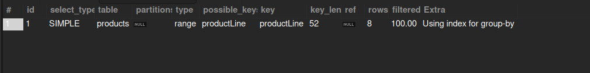
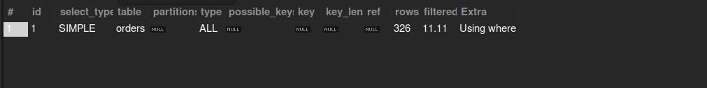

# I. Mysql


### Connection Management
Mỗi kết nối của client (phần mềm truy cập) sẽ có một tiến trình (thread) riêng biệt trên server (máy chủ), và bên trong kết nối đó, truy vấn sẽ được thực thi cho client. Máy chủ cũng quản lý các thread cache (bộ nhớ đệm tiến trình) để giảm thiểu chi phí quản lý kết nối. Máy chủ cho phép truy cập vào mỗi yêu cầu kết nối của client với phương thức xác thực dựa trên tên người dùng, mật khẩu và host (máy chủ của client).

Các chiến lược quản lý kết nối MySQL:
- Sử dụng connection pool: Connection pool là một cách hiệu quả để quản lý kết nối MySQL. MySQL cung cấp một số implementation khác nhau cho connection pool, chẳng hạn như MySQLConnectionPoolDataSource và HikariCP.
- Điều chỉnh kích thước connection pool: Kích thước connection pool nên được điều chỉnh phù hợp với nhu cầu của ứng dụng. Nếu pool quá nhỏ, có thể dẫn đến tình trạng thiếu kết nối và giảm hiệu suất. Nếu pool quá lớn, có thể lãng phí tài nguyên.
- Thiết lập timeout: Timeout nên được thiết lập phù hợp với thời gian sử dụng kết nối trung bình của ứng dụng. Nếu timeout quá ngắn, có thể dẫn đến việc đóng kết nối không cần thiết. Nếu timeout quá dài, có thể dẫn đến việc chiếm dụng kết nối bởi các client không hoạt động.
- Giám sát hiệu suất kết nối: Hiệu suất kết nối nên được giám sát để xác định các vấn đề tiềm ẩn, chẳng hạn như rò rỉ kết nối hoặc pool quá nhỏ.
### Query Cache
Bộ nhớ cache trong MySQL đóng vai trò thiết yếu cho hiệu suất và chủ yếu được sử dụng dưới dạng Query Cache (bộ nhớ cache truy vấn) và Key Cache (bộ nhớ cache key). Khi một client gửi một truy vấn tương tự, máy chủ sẽ không phân tích cú pháp và thực thi lại truy vấn đó mà chỉ cần trích xuất kế hoạch thực thi từ Query Cache. Trong khi đó, Key Cache được dùng để lưu trữ các chỉ mục bảng (table index), sau đó được sử dụng bởi các công cụ lưu trữ (storage engine).

Query Cache được kích hoạt theo mặc định trong MySQL. Để kiểm tra trạng thái của Query Cache, bạn có thể sử dụng lệnh sau:

`SHOW VARIABLES LIKE 'query_cache_type';`

Kết quả sẽ hiển thị giá trị của biến query_cache_type. Nếu giá trị là ON, Query Cache được kích hoạt. Nếu giá trị là OFF, Query Cache bị vô hiệu hóa.
### Parser (bộ phân tích cú pháp)
Là một thành phần quan trọng trong hệ thống quản trị cơ sở dữ liệu MySQL. Nó chịu trách nhiệm phân tích cú pháp của các truy vấn SQL do người dùng gửi đến, đảm bảo rằng truy vấn được viết hợp lệ và có thể được thực thi bởi MySQL.

Quá trình phân tích cú pháp của Parser bao gồm các bước sau:
- Phân chia chuỗi truy vấn thành các token: Mỗi token là một đơn vị cú pháp cơ bản, chẳng hạn như từ khóa, tên bảng, tên cột hoặc toán tử.
- Phân tích cấu trúc ngữ pháp của truy vấn: Parser xác định mối quan hệ giữa các token và đảm bảo rằng truy vấn tuân theo các quy tắc ngữ pháp của SQL.
- Kiểm tra tính hợp lệ của truy vấn: Parser kiểm tra xem các bảng, cột và các đối tượng khác được tham chiếu trong truy vấn có tồn tại hay không và đảm bảo rằng các thao tác được thực hiện hợp lệ.
- Xây dựng cây phân tích cú pháp: Cây phân tích cú pháp là một biểu diễn cấu trúc ngữ pháp của truy vấn. Cây này được sử dụng bởi các thành phần khác của MySQL để xử lý truy vấn.

e.g: SELECT name FROM users WHERE id=1;


### Optimizer
Trình tối ưu hóa chịu trách nhiệm tạo ra kế hoạch thực thi hiệu quả nhất cho các truy vấn SQL. Kế hoạch thực thi xác định cách thức truy vấn sẽ được thực thi, bao gồm các bảng nào sẽ được truy cập, các chỉ mục nào sẽ được sử dụng và các thao tác nào sẽ được thực hiện trên dữ liệu.


Hoạt động của Optimizer:
- Phân tích cú pháp: Optimizer bắt đầu bằng việc phân tích cú pháp truy vấn SQL để hiểu cấu trúc và ý nghĩa của truy vấn.
- Phân tích ngữ nghĩa: Sau đó, Optimizer tiến hành phân tích ngữ nghĩa để xác định các đối tượng được tham chiếu trong truy vấn, bao gồm bảng, cột, điều kiện lọc và biểu thức.
- Lựa chọn chiến lược truy vấn: Dựa trên thông tin thu thập được, Optimizer sẽ lựa chọn chiến lược truy vấn phù hợp nhất, ví dụ như sử dụng chỉ mục, quét bảng đầy đủ, hoặc kết hợp cả hai.
- Tạo kế hoạch thực thi: Optimizer sẽ tạo ra một kế hoạch thực thi chi tiết, bao gồm các bước cụ thể để thực hiện truy vấn, thứ tự thực hiện các thao tác, và các nguồn lực cần thiết.
- Lựa chọn thuật toán: Optimizer sẽ lựa chọn thuật toán tối ưu cho từng thao tác trong kế hoạch thực thi, ví dụ như thuật toán sắp xếp, thuật toán kết hợp, hoặc thuật toán tham gia.
- Điều chỉnh kế hoạch: Dựa trên thông tin thống kê và các yếu tố khác, Optimizer có thể điều chỉnh kế hoạch thực thi để tối ưu hóa hiệu suất cho từng truy vấn cụ thể.


### Storage Engine
#### InnoDB
Là cơ chế lưu dữ liệu mặc định cho MySQL. Có 1 một lời khuyên rằng "You should use InnoDB for your tables unless you have a compelling need to use a different engine" để nói lên sự phổ biến và hữu dụng của cơ chế lưu trữ này. 

InnoDB sử dung cơ chế MVCC để đạt được tính đồng bộ cao, cách đánh index của InnoDB cũng khác với các cơ chế lưu trữ khác của MySQL. 

Đặc điểm chính của InnoDB:
- Hỗ trợ giao dịch ACID: InnoDB đảm bảo tính toàn vẹn dữ liệu bằng cách hỗ trợ các tính năng giao dịch ACID (Nguyên tử, nhất quán, cô lập, bền vững).
- Khóa hàng: InnoDB sử dụng khóa cấp hàng và khóa cấp bản ghi để ngăn chặn tình trạng tranh chấp dữ liệu khi nhiều người dùng truy cập và cập nhật dữ liệu đồng thời.
- Hỗ trợ foreign key: InnoDB hỗ trợ foreign key để đảm bảo tính toàn vẹn tham chiếu dữ liệu giữa các bảng.
- Phục hồi dữ liệu: InnoDB cung cấp cơ chế phục hồi dữ liệu tốt, giúp giảm thiểu nguy cơ mất dữ liệu do lỗi phần cứng hoặc phần mềm.
- Khả năng mở rộng: InnoDB có thể được mở rộng bằng cách thêm dung lượng lưu trữ hoặc máy chủ vào hệ thống.

Ưu điểm của InnoDB:
- Tính toàn vẹn dữ liệu: InnoDB đảm bảo tính toàn vẹn dữ liệu cao nhờ hỗ trợ giao dịch ACID và khóa hàng.
- Khả năng mở rộng: InnoDB có thể được mở rộng dễ dàng để đáp ứng nhu cầu của các ứng dụng lớn.
- Độ tin cậy cao: InnoDB là engine lưu trữ tin cậy với khả năng phục hồi dữ liệu tốt.
- Hỗ trợ nhiều tính năng: InnoDB hỗ trợ nhiều tính năng cao cấp, chẳng hạn như foreign key, triggers và stored procedures.

Nhược điểm của InnoDB:
- Tốc độ truy xuất dữ liệu: InnoDB có thể chậm hơn MyISAM cho các truy vấn chỉ đọc.
- Tiêu hao dung lượng: InnoDB lưu trữ dữ liệu và chỉ mục trong các tập tin riêng biệt, có thể tốn nhiều dung lượng lưu trữ hơn MyISAM.
#### MyISAM
MyISAM là một engine lưu trữ phổ biến trong hệ quản trị cơ sở dữ liệu MySQL. Nó được biết đến với tốc độ truy xuất dữ liệu nhanh và đơn giản, dễ sử dụng. Tuy nhiên, MyISAM có một số hạn chế về tính năng so với các engine khác, chẳng hạn như InnoDB.

Đặc điểm chính của MyISAM:
- Tốc độ truy xuất dữ liệu nhanh: MyISAM sử dụng cơ chế lưu trữ bảng dạng tập tin, giúp truy xuất dữ liệu nhanh chóng, đặc biệt là đối với các truy vấn chỉ đọc.
- Dễ sử dụng: MyISAM là engine lưu trữ mặc định trong MySQL và được cấu hình đơn giản.
- Hỗ trợ tốt cho các ứng dụng chỉ đọc: MyISAM phù hợp cho các ứng dụng chỉ đọc, chẳng hạn như website tĩnh hoặc kho dữ liệu.
- Không hỗ trợ giao dịch ACID: MyISAM không hỗ trợ các tính năng giao dịch ACID (Nguyên tử, nhất quán, cô lập, bền vững), do đó không phù hợp cho các ứng dụng đòi hỏi tính toàn vẹn dữ liệu cao.
- Không hỗ trợ khóa hàng: MyISAM sử dụng khóa cấp bảng, có thể gây ra tình trạng tranh chấp dữ liệu khi nhiều người dùng truy cập và cập nhật dữ liệu đồng thời.

Ưu điểm của MyISAM:
- Tốc độ: MyISAM là engine lưu trữ nhanh nhất trong MySQL cho các truy vấn chỉ đọc.
- Dễ sử dụng: MyISAM là engine lưu trữ dễ sử dụng và cấu hình đơn giản.
- Tiết kiệm dung lượng: MyISAM lưu trữ dữ liệu và chỉ mục trong cùng một tập tin, giúp tiết kiệm dung lượng lưu trữ.

Nhược điểm của MyISAM:
- Không hỗ trợ giao dịch ACID: MyISAM không phù hợp cho các ứng dụng đòi hỏi tính toàn vẹn dữ liệu cao.
- Không hỗ trợ khóa hàng: MyISAM có thể gây ra tình trạng tranh chấp dữ liệu khi nhiều người dùng truy cập và cập nhật dữ liệu đồng thời.
- Hạn chế về tính năng: MyISAM không hỗ trợ một số tính năng cao cấp như replication và foreign key.

|         Tính năng        |               InnoDB              |                                                       MyISAM                                                       |
|:------------------------:|:---------------------------------:|:------------------------------------------------------------------------------------------------------------------:|
| Tốc độ truy xuất dữ liệu | Chậm hơn MyISAM                   | Nhanh                                                                                                              |
| Hỗ trợ giao dịch ACID    | Có                                | Không                                                                                                              |
| Hỗ trợ khóa hàng         | Khóa cấp hàng và khóa cấp bản ghi | Khóa cấp bảng                                                                                                      |
| Tính năng                | Phong phú                         | Hạn chế                                                                                                            |
| Sử dụng cho              | Hầu hết các ứng dụng              | Ứng dụng chỉ đọc, ứng dụng không đòi hỏi tính toàn vẹn dữ liệu cao, ứng dụng cần hiệu suất truy xuất dữ liệu nhanh |
# II. Tối ưu hóa câu truy vấn 
### 1. Tránh sử dụng SELECT *
Chỉ chọn các cột cần thiết thay vì sử dụng "SELECT *". Điều này giảm lượng dữ liệu được truyền và cải thiện hiệu năng của cơ sở dữ liệu.

```
eg:

SELECT * FROM customers WHERE country ='USA'
```


```
Tối ưu

SELECT customerName, phone FROM customers
WHERE country ='USA'

```


### 2. Sử dụng index
Chỉ mục giúp MySQL tìm và truy xuất dữ liệu cần thiết một cách nhanh chóng mà không cần quét toàn bộ bảng.
```
eg:
SELECT * FROM customers WHERE customerName = 'Herkku Gifts';
```


```

Tối ưu:

CREATE INDEX idx_customer_name ON customers (customerName)
SELECT * FROM customers WHERE customerName = 'Herkku Gifts';

```


Xác định dữ liệu được truy cập thường xuyên và các cột được sử dụng trong mệnh đề WHERE, JOIN và ORDER BY, sau đó tạo chỉ mục trên các cột đó. 

Tránh tạo quá nhiều chỉ mục, vì quá nhiều chỉ mục có thể làm chậm các thao tác chèn, cập nhật và xóa.
### 3. Sử dụng JOIN thay vì subquery

JOIN: Kết hợp dữ liệu từ hai bảng hoặc nhiều bảng dựa trên một cột chung hoặc một điều kiện nào đó.

Subquery: Một truy vấn nằm lồng bên trong một truy vấn khác, thường được sử dụng để trả về một tập kết quả dùng làm điều kiện cho truy vấn bên ngoài.

Ưu tiên sử dụng join:
- Trình tối ưu hóa: Hệ thống quản trị cơ sở dữ liệu (DBMS) thường có trình tối ưu hóa mạnh mẽ để tối ưu hóa các truy vấn JOIN.
- Ít quét bảng: JOIN thường chỉ quét các bảng một lần, trong khi Subquery có thể dẫn đến việc quét nhiều lần, đặc biệt khi Subquery phức tạp.
```
eg:
SELECT customerName FROM  customers WHERE customerNumber IN (SELECT customerNumber FROM orders WHERE orderDate = '2003-11-11');

```


```
Tối ưu:

SELECT c.customerName
FROM customers c
INNER JOIN orders o ON c.customerNumber = o.customerNumber
WHERE o.orderDate = '2003-11-11';

```


### 4. Sử dụng EXIST thay vì IN

IN: Kiểm tra xem một giá trị có tồn tại trong một tập hợp các giá trị hay không.

EXISTS: Kiểm tra xem một truy vấn con có trả về bất kỳ hàng nào không.

Trong nhiều trường hợp, sử dụng EXISTS có thể hiệu quả hơn IN:
- Tránh quét toàn bộ bảng: Khi sử dụng IN, MySQL thường phải quét toàn bộ bảng con để tìm các giá trị khớp. Điều này có thể tốn kém về tài nguyên, đặc biệt khi bảng con lớn.

- Ngừng sớm: Với EXISTS, MySQL chỉ cần tìm thấy một hàng khớp trong bảng con là có thể dừng việc quét. Điều này giúp cải thiện hiệu suất, đặc biệt khi điều kiện khớp xảy ra sớm.

```dtd
eg: 
SELECT * FROM orders
WHERE customerNumber IN (SELECT customerNumber FROM customers WHERE city = 'NYC');
```


```
Tối ưu
SELECT * FROM orders o
WHERE EXISTS (
    SELECT 1 FROM customers c
    WHERE c.customerNumber = o.customerNumber AND c.city = 'NYC'
);

```


### 5.  Giới hạn kết quả
Sử dụng LIMIT để giới hạn số lượng hàng mà câu lệnh truy vấn trả về. Điều này có thể tăng đáng kể hiệu năng của MySQL, đặc biệt đối với các câu lệnh truy vấn có tập kết quả lớn.
```dtd
eg
SELECT * from employees;

```

```
Tối ưu:
SELECT * from employees limit 10;
```

### 6. Tránh sử dụng Wildcard ở đầu của câu lệnh LIKE
Wildcard: Ký tự đại diện cho một hoặc nhiều ký tự trong một chuỗi tìm kiếm.

LIKE: Một toán tử được sử dụng để tìm các mẫu trong một cột.

Khi bạn sử dụng một wildcard (*) ở đầu của một câu lệnh LIKE, cơ sở dữ liệu không thể tận dụng các chỉ mục để tối ưu hóa tìm kiếm. Điều này có thể dẫn đến hiệu suất truy vấn kém, đặc biệt là với các bảng lớn.
```
eg:
   SELECT * FROM products WHERE productname LIKE '%Ford';

```


```
Tối ưu
   SELECT * FROM products WHERE productName LIKE 'Ford%'; 

```


### 7. Tránh sử dụng DISTINCT
DISTINCT nhằm loại bỏ các bản ghi trùng lặp trong kết quả truy vấn. Để thực hiện DISTINCT, MySQL phải sắp xếp và so sánh các hàng để tìm ra các hàng duy nhất. Điều này có thể tiêu tốn nhiều tài nguyên, đặc biệt khi tập dữ liệu lớn.

Tránh sử dụng DISTINCT khi không cần thiết
```dtd
eg: 
SELECT DISTINCT * FROM products;
```


```
Tối ưu
SELECT DISTINCT productLine FROM products;
```


### 8. Tránh sử dụng các hàm
Sử dụng các hàm trong điều kiện WHERE của một truy vấn MySQL có thể làm giảm đáng kể hiệu năng, đặc biệt là khi có chỉ mục trên cột đó
- Chỉ mục không hoạt động hiệu quả: Khi bạn áp dụng một hàm lên một cột có chỉ mục, MySQL sẽ không thể sử dụng chỉ mục đó để tìm kiếm dữ liệu. Điều này buộc MySQL phải quét toàn bộ bảng để tìm kết quả, làm giảm đáng kể hiệu năng.
- Tăng thời gian thực thi: Các hàm thường yêu cầu nhiều tài nguyên hơn để tính toán so với việc so sánh trực tiếp các giá trị. Điều này dẫn đến tăng thời gian thực thi của truy vấn.
```
eg:
SELECT * FROM orders
WHERE YEAR(orderdate) = 2004 AND MONTH(orderdate) =1; 

```


```
Tối ưu:
SELECT * FROM orders 
WHERE orderdate BETWEEN '2004-01-01' AND '2004-01-31';
```


### 9. Dùng UNION thay vì OR

- OR: Được sử dụng để kết hợp các điều kiện trong một mệnh đề WHERE, trả về các hàng thỏa mãn ít nhất một trong các điều kiện đó.
- UNION: Được sử dụng để kết hợp kết quả của hai hoặc nhiều truy vấn SELECT thành một tập kết quả duy nhất.

Khi sử dụng OR với nhiều điều kiện, MySQL có thể phải quét toàn bộ bảng để tìm các hàng thỏa mãn. Trong khi đó, UNION chia nhỏ công việc tìm kiếm thành các truy vấn con nhỏ hơn, có thể giúp giảm thời gian thực thi.
  
Union có thể giúp câu truy vấn trở nên nhanh hơn đặt biệt là trong trường hợp đã đánh index một cách hợp lý.
```
eg:
SELECT * FROM products
WHERE productLine = 'Classic Cars' OR productLine = 'Motorcycles';

```


```
Tối ưu
SELECT * FROM products WHERE productLine = 'Classic Cars'
UNION
SELECT * FROM products WHERE productLine = 'Motorcycles';

```


### 10. Sử dụng JOIN HIỆU QUẢ

JOIN là một mệnh đề quan trọng trong SQL, đặc biệt là khi làm việc với nhiều bảng trong cơ sở dữ liệu. Nó cho phép kết hợp dữ liệu từ hai hoặc nhiều bảng dựa trên một cột chung. MySQL hỗ trợ nhiều loại JOIN khác nhau, mỗi loại có mục đích sử dụng riêng.
- INNER JOIN (hoặc JOIN)

   Trả về: Tất cả các hàng có ít nhất một giá trị khớp trong cả hai bảng.

   Sử dụng khi: Bạn muốn tìm những bản ghi có liên quan trực tiếp giữa hai bảng.


- LEFT OUTER JOIN (hoặc LEFT JOIN)

   Trả về: Tất cả các hàng từ bảng bên trái (table1) và chỉ những hàng phù hợp từ bảng bên phải (table2). Nếu không có hàng phù hợp, cột từ bảng bên phải sẽ có giá trị NULL.
  
   Sử dụng khi: Bạn muốn lấy tất cả dữ liệu từ một bảng và chỉ lấy những dữ liệu liên quan từ bảng còn lại.
 
- RIGHT OUTER JOIN (hoặc RIGHT JOIN)

   Trả về: Ngược lại với LEFT JOIN, trả về tất cả các hàng từ bảng bên phải và chỉ những hàng phù hợp từ bảng bên trái.
   
   Sử dụng khi: Tương tự LEFT JOIN, nhưng ưu tiên lấy dữ liệu từ bảng bên phải.

- CROSS JOIN

   Trả về: Tạo ra tất cả các tổ hợp có thể giữa các hàng của hai bảng.
   
   Sử dụng khi: Ít phổ biến hơn, thường dùng để tạo ra một tập dữ liệu lớn từ hai bảng nhỏ hơn.


```
eg:
SELECT e.lastName, e.firstName, o.addressLine1, o.addressLine2, o.city, o.country, o.postalCode
FROM employees e, offices o
WHERE e.officeCode= o.officeCode;

```


```
Tối ưu:
SELECT e.lastName, e.firstName, o.addressLine1, o.addressLine2, o.city, o.country, o.postalCode
FROM employees e
INNER JOIN offices o ON e.officeCode = o.officeCode;
```


## Sử dụng EXPLAIN phân tích

- Hiểu rõ quá trình thực thi: EXPLAIN cho bạn thấy từng bước MySQL sẽ làm gì để trả về kết quả.
- Xác định điểm nghẽn: Nhờ EXPLAIN, bạn có thể tìm ra những phần của truy vấn đang tiêu tốn nhiều thời gian nhất.
- Tối ưu hóa hiệu suất: Dựa vào kế hoạch thực thi, bạn có thể đưa ra các quyết định như tạo chỉ mục, điều chỉnh câu truy vấn hoặc thay đổi cấu trúc bảng để tăng tốc độ.

Cú pháp:
```
EXPLAIN [EXTENDED] SELECT * FROM table_name WHERE condition;
```

Kết quả của EXPLAIN:
- id: Số thứ tự của từng bước. 
- select_type: Loại của một phần trong truy vấn (SIMPLE, UNION, SUBQUERY, ...).
- table: Tên bảng được truy vấn.
- type: Loại truy cập vào bảng (ALL, index, range, ref, eq_ref, ...).
- possible_keys: Các chỉ mục có thể được sử dụng.
- key: Chỉ mục thực sự được sử dụng.
- key_len: Số byte được sử dụng từ chỉ mục.
- rows: Số hàng dự kiến được quét.
- Extra: Thông tin bổ sung về kế hoạch truy vấn.

Các yếu tố ảnh hưởng:
- Chỉ mục: Chỉ mục là chìa khóa để tăng tốc truy vấn. Tạo chỉ mục phù hợp cho các cột thường được sử dụng trong điều kiện WHERE có thể cải thiện đáng kể hiệu suất.
- Câu truy vấn: Cách viết câu truy vấn cũng rất quan trọng. Tránh sử dụng các hàm, subquery phức tạp trong điều kiện WHERE.
- Cấu trúc bảng: Thiết kế bảng ảnh hưởng đến cách MySQL truy xuất dữ liệu.
- Cấu hình MySQL: Các tham số cấu hình của MySQL cũng ảnh hưởng đến kế hoạch thực thi.

Tối ưu hóa dựa trên kết quả EXPLAIN
- Tạo chỉ mục: Tạo chỉ mục cho các cột thường được sử dụng trong điều kiện WHERE hoặc ORDER BY.
- Điều chỉnh câu truy vấn: Viết lại câu truy vấn để sử dụng chỉ mục hiệu quả hơn.
- Phân tích bảng: Kiểm tra các bảng để đảm bảo chúng được thiết kế hợp lý.
- Tối ưu hóa MySQL: Điều chỉnh các tham số của MySQL.
# III. Database

|                                      | Cơ sở dữ liệu quan hệ                                                                                                                                                                                                                                                                                                                                                                                                                                                                                                                                                                                                                               | Cơ sở dữ liệu NoSQL                                                                                                                                                                                                                                                                                                                                                                                                             |
|--------------------------------------|-----------------------------------------------------------------------------------------------------------------------------------------------------------------------------------------------------------------------------------------------------------------------------------------------------------------------------------------------------------------------------------------------------------------------------------------------------------------------------------------------------------------------------------------------------------------------------------------------------------------------------------------------------|---------------------------------------------------------------------------------------------------------------------------------------------------------------------------------------------------------------------------------------------------------------------------------------------------------------------------------------------------------------------------------------------------------------------------------|
| Khối lượng công việc tối ưu          | Cơ sở dữ liệu quan hệ  được thiết kế dành cho các ứng dụng xử lý giao dịch trực tuyến (OLTP)  trong giao dịch có độ ổn định cao. Chúng cũng hữu ích để xử lý phân tích  trực tuyến (OLAP).                                                                                                                                                                                                                                                                                                                                                                                                                                                          | Các cơ sở dữ liệu NoSQL được  thiết kế cho các mẫu truy cập dữ liệu, bao gồm các ứng dụng có độ trễ  thấp. Cơ sở dữ liệu tìm kiếm NoSQL được thiết kế để phục vụ phân tích dữ  liệu có cấu trúc chưa hoàn chỉnh.                                                                                                                                                                                                                |
| Mô hình dữ liệu                      | Mô hình quan hệ chuẩn hóa dữ  liệu vào bảng được hình thành từ hàng và cột. Sơ đồ quy định rõ ràng  bảng, hàng, cột, chỉ mục, mối quan hệ giữa các bảng và các thành tố cơ  sở dữ liệu khác. Cơ sở dữ liệu sẽ thực thi tính toàn vẹn tham chiếu  trong mối quan hệ giữa các bảng.                                                                                                                                                                                                                                                                                                                                                                   | Các cơ sở dữ liệu NoSQL cung  cấp nhiều mô hình dữ liệu khác nhau như khóa-giá trị, tài liệu, biểu đồ  và cột, được tối ưu hóa để đạt hiệu năng và quy mô tối ưu.                                                                                                                                                                                                                                                               |
| Thuộc tính ACID                      | Cơ sở dữ liệu quan hệ có các thuộc tính mang tính nguyên tố, nhất quán, tách biệt và bền vững (ACID):                                Tính nguyên tố đòi hỏi giao dịch phải được thực thi đầy đủ hoặc hoàn toàn không thực hiện.                 Tính nhất quán đòi hỏi rằng khi dữ liệu phải nhất quán với sơ đồ cơ sở dữ liệu giao dịch được thực hiện.                 Tính tách biệt đòi hỏi rằng các giao dịch diễn ra đồng thời phải được thực thi tách biệt với nhau.                 Tính bền vững đòi hỏi phải có khả năng phục hồi từ tình  trạng hư hỏng hệ thống hoặc mất điện đột ngột về trạng thái đã biết  cuối cùng.                | Hầu hết cơ sở dữ liệu NoSQL  thường phải đánh đổi bằng cách nới lỏng một số thuộc tính ACID này của  cơ sở dữ liệu quan hệ để có mô hình dữ liệu linh hoạt hơn có khả năng  thay đổi quy mô theo chiều ngang. Việc này biến các cơ sở dữ liệu NoSQL  thành lựa chọn tuyệt vời cho các trường hợp sử dụng cần thông lượng cao,  độ trễ thấp cần thay đổi quy mô theo chiều ngang vượt qua giới hạn của  một phiên bản duy nhất.  |
| Hiệu năng                            | Hiệu năng thường phụ thuộc  vào hệ thống con của ổ đĩa. Thông thường, việc tối ưu hóa các truy vấn,  chỉ mục và cấu trúc bảng bắt buộc phải được thực hiện để đạt mức hiệu  năng tối đa.                                                                                                                                                                                                                                                                                                                                                                                                                                                            | Hiệu năng thường được xem là chức năng của kích cỡ cụm phần cứng ngầm, độ trễ mạng và ứng dụng đưa ra lệnh gọi.                                                                                                                                                                                                                                                                                                                 |
| Điều chỉnh quy mô                    | Cơ sở dữ liệu quan hệ thường  tăng quy mô bằng cách tăng năng lực điện toán của phần cứng hoặc tăng  quy mô bằng cách thêm bản sao của khối lượng công việc chỉ đọc.                                                                                                                                                                                                                                                                                                                                                                                                                                                                                | Cơ sở dữ liệu NoSQL thường có  thể phân mảnh. Điều này là do các mẫu truy cập khóa-giá trị có khả năng  tăng quy mô bằng cách sử dụng kiến trúc được phân phối để tăng thông  lượng, đem đến hiệu năng ổn định với quy mô gần như không giới hạn.                                                                                                                                                                               |
| API                                  | Yêu cầu lưu trữ và truy xuất  dữ liệu được truyền đạt bằng cách sử dụng các truy vấn nhất quán với  ngôn ngữ truy vấn có cấu trúc (SQL). Các truy vấn này được phân tích và  thực thi bởi cơ sở dữ liệu quan hệ.                                                                                                                                                                                                                                                                                                                                                                                                                                    | API trên cơ sở đối tượng cho  phép các nhà phát triển ứng dụng dễ dàng lưu trữ và truy xuất cấu trúc  dữ liệu trong bộ nhớ. Khóa phân mảnh tìm kiếm các cặp khóa-giá trị, tập  hợp cột hoặc văn bản có cấu trúc chưa hoàn chỉnh có chứa đối tượng và  thuộc tính của ứng dụng được xếp theo chuỗi.                                                                                                                              |

## 1. SQL Database
### 1.1 PostgreSQL
PostgreSQL là một hệ thống quản trị cơ sở dữ liệu quan hệ-đối tượng (object-relational database management system) mã nguồn mở


- Kiểu dữ liệu đa dạng: Hỗ trợ nhiều loại kiểu dữ liệu, bao gồm kiểu nguyên thủy (số nguyên, số thực, chuỗi, boolean), kiểu cấu trúc (ngày/giờ, mảng, phạm vi, UUID), kiểu tài liệu (JSON/JSONB, XML, key-value), kiểu hình học (điểm, đường thẳng, vòng tròn, đa giác) và kiểu tùy chỉnh.

- Toàn vẹn dữ liệu: Có rất nhiều tính năng để đảm bảo tính toàn vẹn của dữ liệu, bao gồm khóa chính (primary keys), khóa ngoại (foreign keys), ràng buộc duy nhất (unique), ràng buộc not-null và ràng buộc loại trừ (check constraint).

- Hiệu suất: PostgreSQL có nhiều tính năng để cải thiện hiệu suất, bao gồm lập danh mục (b-tree, multicolumn, expressions, partial), lập danh mục nâng cao (GiST, SP-Gist, KNN GiST, GIN, BRIN, Bloom filters), trình lập kế hoạch/trình tối ưu hóa truy vấn phức tạp, quét index-only và thống kê số liệu trên nhiều cột.

- Điều khiển đồng thời: Điều khiển đồng thời nhiều phiên bản (MVCC) và truy vấn đọc song song.

- Độ tin cậy và phục hồi sau thảm hoạ: đảm bảo độ tin cậy và phục hồi sau thảm hoạ, bao gồm ghi nhật ký ghi trước (Write-ahead Logging – WAL), replication, khôi phục điểm-theo-thời-gian (Point-in-time-recovery – PITR) và không gian bảng.

- Bảo mật: bao gồm xác thực qua nhiều phương thức, hệ thống kiểm soát truy cập mạnh mẽ, bảo mật cấp độ cột và hàng.

- Khả năng mở rộng: PostgreSQL có khả năng mở rộng cao, bao gồm hỗ trợ nhiều ngôn ngữ thủ tục (PL/PGSQL, Perl, Python), trình wrapper dữ liệu ngoài và nhiều tiện ích mở rộng bổ sung như PostGIS.
tính năng đáng chú ý của PostgreSQL

- Điều chỉnh và cấu hình tùy chỉnh: cho phép người dùng điều chỉnh và tùy chỉnh cấu hình theo nhu cầu của họ. Các cấu hình được cung cấp bao gồm tối ưu hóa hiệu suất, quản lý bộ đệm, quản lý kết nối, và nhiều hơn nữa.

- Tích hợp với các ngôn ngữ lập trình: PostgreSQL hỗ trợ nhiều ngôn ngữ lập trình như PL/pgSQL, PL/Python, PL/Perl, PL/Tcl, PL/Java và PL/R. Điều này cho phép người dùng viết các chức năng tùy chỉnh và lưu trữ thủ tục trực tiếp trong cơ sở dữ liệu.

- Tiện ích mở rộng: PostgreSQL có thư viện tiện ích mở rộng bao gồm PostGIS, hỗ trợ địa lý và địa chính xác; pgAdmin, một công cụ quản lý cơ sở dữ liệu đồ họa; và một loạt các công cụ khác để hỗ trợ việc phát triển và quản lý cơ sở dữ liệu PostgreSQL.

- Khả năng mở rộng: PostgreSQL có thể mở rộng để quản lý các cơ sở dữ liệu lớn với hàng trăm terabyte hoặc petabyte dữ liệu và hàng nghìn người dùng. Nó có thể được triển khai trên nhiều máy chủ để tăng khả năng phục vụ và đảm bảo sự ổn định và tin cậy.

- Tính bảo mật: PostgreSQL có các tính năng bảo mật mạnh mẽ như xác thực đa cấp độ, quản lý truy cập, mã hóa và kiểm tra toàn vẹn dữ liệu. Nó cũng hỗ trợ các tiêu chuẩn bảo mật như SSL và GSSAPI.

- Tính sẵn sàng: PostgreSQL hỗ trợ các tính năng sẵn sàng như sao lưu và khôi phục, sao lưu điểm thời gian, và sao lưu phân tán. Điều này đảm bảo rằng các cơ sở dữ liệu của bạn luôn sẵn sàng và có khả năng phục hồi trong trường hợp xảy ra thảm họa hoặc sự cố.
  


##### PostgreSQL có nhiều ưu điểm nổi bật:


1. OS Support

    PostgreSQL có sẵn trên nhiều hệ điều hành, bao gồm Linux, Windows, macOS và BSD. Nó cũng là một giải pháp được lưu trữ trên đám mây, giúp dễ dàng triển khai trên đám mây hoặc tại chỗ. Điều này giúp người dùng dễ dàng cài đặt, cấu hình và quản lý cơ sở dữ liệu, bất kể môi trường của họ.
2. Features
   
    Nó đi kèm với một loạt các tính năng, bao gồm hỗ trợ cho các ngôn ngữ thủ tục, trigger, kế thừa bảng và lập chỉ mục. Nó cũng hỗ trợ các kiểu dữ liệu khác nhau, bao gồm JSON, XML và các kiểu dữ liệu GIS. Điều này làm cho nó trở thành lựa chọn lý tưởng cho các ứng dụng yêu cầu một loạt các kiểu dữ liệu.

3. Extensibility
   
    Nó có khả năng mở rộng cao, cho phép người dùng thêm các phần mở rộng, kiểu dữ liệu và hàm tùy chỉnh. Điều này giúp dễ dàng tùy chỉnh hệ thống cơ sở dữ liệu để đáp ứng nhu cầu của ứng dụng của họ.

4.  Procedural Language Support
   
    PostgreSQL hỗ trợ một loạt các ngôn ngữ thủ tục, bao gồm PL/pgSQL, PL/Python và PL/Perl. Viết các thủ tục lưu trữ và mã thủ tục khác để hỗ trợ logic ứng dụng trở nên dễ dàng.

5. Object Relational Model

    Nó hỗ trợ một mô hình quan hệ đối tượng, cho phép người dùng lưu trữ dữ liệu theo cách quan hệ và hướng đối tượng. Điều này giúp dễ dàng mô hình hóa các cấu trúc dữ liệu và mối quan hệ phức tạp.

6. Concurrency
   
    Nó hỗ trợ mức độ truy cập đồng thời cao, cho phép nhiều người dùng truy cập cùng một dữ liệu cùng một lúc mà không ảnh hưởng đến hiệu suất. Điều này làm cho nó trở thành lựa chọn lý tưởng cho các ứng dụng xử lý lượng lớn dữ liệu đồng thời.

7. Compliance
   
     Tuân thủ nhiều tiêu chuẩn, bao gồm SQL, ACID và GIS. Điều này giúp dễ dàng tuân thủ các quy định và tiêu chuẩn dữ liệu đồng thời đảm bảo tính toàn vẹn, bảo mật và riêng tư của dữ liệu.


##### Hạn chế của PostgreSQL


1. Memory Usage

    Các cơ sở dữ liệu PostgreSQL được biết đến với việc sử dụng bộ nhớ cao. Các cài đặt mặc định cho cơ sở dữ liệu PostgreSQL lớn chiếm nhiều bộ nhớ hơn các cơ sở dữ liệu khác, điều này có thể là vấn đề đối với người dùng có phần cứng hạn chế. Ngoài ra, cơ sở dữ liệu PostgreSQL yêu cầu nhiều bộ nhớ hơn cho một số hoạt động nhất định, chẳng hạn như sắp xếp và lập chỉ mục, điều này có thể gây ra các vấn đề về bộ nhớ bổ sung.

2. Complexity

    Đây là một cơ sở dữ cú mạnh mẽ, nhưng nó cũng có thể phức tạp. Ngay cả những người dùng có kinh nghiệm cũng có thể thấy khó hiểu cú pháp PostgreSQL và tạo các truy vấn phức tạp. Độ phức tạp này có thể là một rào cản đối với người dùng mới bắt đầu với PostgreSQL.

3. Lack of Tooling

    PostgreSQL là một cơ sở dữ liệu mạnh mẽ, nhưng nó cần một số công cụ và tiện ích có sẵn cho các cơ sở dữ liệu khác. Ví dụ, PostgreSQL không có giao diện người dùng đồ họa (GUI) để quản lý và truy vấn cơ sở dữ liệu. Điều này có thể khiến người dùng khó quản lý cơ sở dữ liệu của họ và thực hiện các thay đổi.

4. Lack Powerful
   
    PostgreSQL không thể sử dụng các thủ tục được lưu trữ hoặc trigger. Những tính năng này có thể tự động hóa một số quy trình, chẳng hạn như xác thực dữ liệu hoặc lưu trữ. Điều này có thể khiến việc tạo các ứng dụng mạnh mẽ và hiệu quả với PostgreSQL trở nên khó khăn. PostgreSQL là một cơ sở dữ liệu mạnh mẽ, nhưng nó có những hạn chế của mình. Người dùng nên biết về những hạn chế này trước khi chọn PostgreSQL làm cơ sở dữ liệu của họ.
### 1.2 Oracle Databse
Oracle Database được xây dựng dựa trên tiêu chuẩn hoá của ngôn ngữ lập trình SQL cho phép quản lý và truy vấn dữ liệu trên máy chủ một cách hiệu quả. Phần mềm hỗ trợ có PL/SQL được Oracle áp dụng để phát triển các tính năng độc quyền cho SQL. Ngoài ra, Oracle Database còn cho phép người dùng lập trình bằng Java, chương trình hoặc ngôn ngữ bất kỳ.


Database kết nối phần tử dữ liệu bằng các cấu trúc bảng và cho ra các kết quả lưu trữ khác nhau hỗ trợ xử lý dữ liệu dễ dàng hơn. Các mô hình kiến trúc của Oracle bao gồm một số các ràng buộc ACID đảm bảo tính chính xác cao nhất và độ xử lý tin cậy cho dữ liệu. ACID là các nguyên tắc về nguyên tử, tính thống nhất, độc lập và độ bền của dữ liệu chính.

Kiến trúc của Oracle Database bao gồm:
- Cấu trúc lưu trữ vật lý của cơ sở dữ liệu là các tệp chứa dữ liệu, siêu dữ liệu và các tệp quản lý ghi lại thay đổi của dữ liệu. Cơ sở dữ liệu và các phiên bản của nó thực hiện lưu trữ và quản lý các tệp.
- Cấu trúc lưu trữ logic của Oracle Database bao gồm khối dữ liệu là các phạm vi và nhóm các khối dữ liệu liền kề nhau. Phân đoạn là tập hợp các phạm vi mở rộng. Không gian bảng là các vùng chứa cho phân đoạn.


1. Khả năng di chuyển

   Cơ sở dữ liệu Oracle được hỗ trợ trên nhiều nền tảng khác nhau so với các đối thủ cạnh tranh. Nó chạy dễ dàng trên gần 20 giao thức mạng và hơn 100 nền tảng phần cứng. Điều này giúp việc viết ứng dụng Oracle trở nên dễ dàng bằng cách thực hiện thay đổi an toàn trong hệ điều hành và phần cứng.

2. Sao lưu và phục hồi

   Oracle là một lựa chọn tốt để thực hiện sao lưu toàn bộ cơ sở dữ liệu trực tuyến cũng như phục hồi. Với cơ sở dữ liệu Oracle, bạn có thể dễ dàng thực hiện khôi phục điểm thời gian. Điều này yêu cầu không gian lưu trữ và cơ chế lưu trữ.

3. Hiệu suất cao

   Cơ sở dữ liệu Oracle cung cấp tốc độ cao và khả năng xử lý cơ sở dữ liệu lớn. Oracle cải thiện hiệu suất thông qua kiểm soát giao dịch và khóa.

4. Hỗ trợ nhiều cơ sở dữ liệu

   Một lợi thế lớn của Oracle là khả năng quản lý nhiều cơ sở dữ liệu trong cùng một giao dịch. Tính năng này được triển khai từ phiên bản V7.

5. Sự hiện diện trên thị trường

   Oracle là nhà cung cấp RDBMS lớn nhất và đầu tư nhiều hơn cho nghiên cứu và phát triển so với các đối thủ. Oracle chiếm thị phần lớn nhất trong lĩnh vực máy chủ VMS, UNIX và OS/2. Điều này đảm bảo rằng bạn sẽ không bị bỏ rơi bởi Oracle vì có rất nhiều giao diện của bên thứ ba được hỗ trợ. Bạn cũng có thể dễ dàng tìm được nhân viên có chuyên môn.

6. Thay đổi phiên bản

   Oracle thông báo cho bạn về các thay đổi tiềm năng trong phiên bản tiếp theo để bạn có thể chuẩn bị. Nó cung cấp khả năng tương thích ngược tốt, giúp bạn không cần phải viết lại ứng dụng khi nâng cấp DBMS. Nhiều người đã làm việc với Oracle từ phiên bản Beta V4 và chưa gặp phải bất kỳ vấn đề nào về cú pháp.

7. Độ phức tạp

   Một nhược điểm lớn của Oracle là độ phức tạp. Oracle không phù hợp với người dùng không có kiến thức kỹ thuật. Oracle cũng không phù hợp cho các công ty hoặc cá nhân tìm kiếm cơ sở dữ liệu dễ sử dụng với các tính năng cơ bản. Việc cài đặt và sử dụng Oracle không đơn giản và yêu cầu kỹ năng chuyên môn.

8. Chi phí

   Giá của sản phẩm Oracle có thể cao gấp 10 lần so với giải pháp cơ sở dữ liệu MS SQL Server cho giải pháp tầm trung. Do đó, người dùng thường chọn các tùy chọn rẻ hơn như MySQL miễn phí hoặc các công cụ trên AWS với chi phí thấp. Giá cả bản quyền Oracle thay đổi theo thời gian tùy thuộc vào chính sách, bản vá và cập nhật của công ty.

9. Khó quản lý

   Oracle thường phức tạp hơn trong việc quản lý một số hoạt động. Lời khuyên là cài đặt phiên bản cơ bản và cấu hình với tối thiểu tùy chỉnh. Oracle phù hợp cho cơ sở dữ liệu lớn. Với các công ty nhỏ và vừa, MySQL là lựa chọn tốt hơn vì hiệu quả về chi phí.


## 2. NoSQL Database
### 2.1 MongoDB
MongoDB là một hệ quản trị cơ sở dữ liệu NoSQL mã nguồn mở, được sử dụng phổ biến để lưu trữ, truy xuất và quản lý dữ liệu phi cấu trúc và bán cấu trúc.
Nhờ vào cơ sở dữ liệu NoSQL, dữ liệu được lưu trữ dưới dạng collection và document. Do đó, cơ sở dữ liệu, collection và document có mối liên hệ với nhau như hình dưới đây


Cách cơ sở dữ liệu MongoDB chứa các collection cũng giống như cách cơ sở dữ liệu MySQL chứa các table.

Bên trong collection, chúng ta có document. Các document này chứa dữ liệu mà bạn muốn lưu trữ trong cơ sở dữ liệu MongoDB và một collection có thể chứa nhiều document. Đồng thời, với tính chất schema-less (không cần một cấu trúc lưu trữ dữ liệu), document này không nhất thiết phải giống với document khác.

Các document được tạo bằng cách sử dụng các field (trường). Các field là các cặp khóa-giá trị trong document, giống như các column trong cơ sở dữ liệu quan hệ. Giá trị của các field có thể là bất kỳ loại dữ liệu BSON nào như double, string, boolean, v.v.


#### Ưu điểm MongoDB

MongoDB mang đến cho người sử dụng một số ưu điểm:
- Không schema: Giống như các cơ sở dữ liệu NoSQL khác, MongoDB không yêu cầu các schema được xác định trước.
- MongoDB lưu trữ bất kỳ loại dữ liệu nào: Điều này cho phép người dùng linh hoạt tạo số lượng trường trong document theo nhu cầu, và giúp việc mở rộng cơ sở dữ liệu MongoDB trở nên dễ dàng hơn so với cơ sở dữ liệu quan hệ truyền thống.
- Hướng document: Một trong những ưu điểm của việc sử dụng document là các đối tượng này ánh xạ tới các kiểu dữ liệu gốc trong một số ngôn ngữ lập trình. Việc có các document được nhúng cũng làm giảm nhu cầu kết nối cơ sở dữ liệu, điều này có thể làm giảm chi phí.
- Khả năng mở rộng: Kiến trúc mở rộng theo chiều ngang của MongoDB giúp bạn tạo ra một ứng dụng có thể xử lý được lưu lượng truy cập tăng đột biến khi doanh nghiệp của bạn phát triển. Ngoài ra, việc phân chia dữ liệu (sharding) cho phép cơ sở dữ liệu phân phối dữ liệu trên một cụm máy. MongoDB cũng hỗ trợ tạo vùng dữ liệu dựa trên shard key.
- Hỗ trợ bên thứ ba: MongoDB hỗ trợ một số công cụ lưu trữ và cung cấp API công cụ lưu trữ có thể cắm được (pluggable storage engine API) cho phép các bên thứ ba phát triển công cụ lưu trữ dữ liệu riêng.
- Linh hoạt lưu trữ tệp dung lượng lớn: MongoDB phát triển hệ thống tệp riêng GridFS, gần giống với hệ thống tệp phân tán Hadoop. Việc sử dụng hệ thống tệp nhằm để lưu trữ các tệp vượt qua kích thước giới hạn của BSON (16 MB cho mỗi document).

#### Khuyết điểm MongoDB

Mặc dù MongoDB mang lại nhiều giá trị lớn, công cụ này vẫn có một số nhược điểm:
- Tính liên tục: Với chiến lược chuyển đổi dự phòng tự động, người dùng chỉ có thể thiết lập một node master trong cụm MongoDB. Nếu node master bị lỗi, một node khác sẽ tự động chuyển đổi thành master mới. Quá trình chuyển đổi này đảm bảo tính liên tục, nhưng không diễn ra tức thời mà có thể mất tới một phút.
- Giới hạn ghi: Node master duy nhất của MongoDB cũng làm giới hạn lại tốc độ ghi dữ liệu vào cơ sở dữ liệu. Việc ghi dữ liệu phải được ghi trên node master và việc ghi thông tin mới vào cơ sở dữ liệu bị giới hạn bởi khả năng của node master đó.
- Tính nhất quán của dữ liệu: MongoDB không cung cấp tính toàn vẹn tham chiếu đầy đủ thông qua việc sử dụng các ràng buộc khóa ngoại (foreign-key), điều này có thể ảnh hưởng đến tính nhất quán của dữ liệu.
- Bảo mật: Tính năng xác thực người dùng không được mặc định bật trong cơ sở dữ liệu MongoDB. Để bảo mật hệ thống trước các cuộc tấn công của tin tặc, bạn có thể thủ công thiết lập các cài đặt chặn những kết nối lạ và không an toàn.

### 2.2 Cassandra


Cassandra là một cơ sở dữ liệu phân tán kết hợp mô hình dữ liệu của Google Bigtable với thiết kế hệ thống phân tán như bản sao của Amazon Dynamo.


Các tính năng chính của Cassandra
1. Khả năng mở rộng: Cassandra được thiết kế để dễ dàng mở rộng theo chiều ngang bằng cách thêm nhiều nút (node) vào cụm. Điều này giúp Cassandra có thể xử lý lượng lớn dữ liệu và truy cập đồng thời cao. Dữ liệu được phân tán trên nhiều nút, giúp cải thiện hiệu suất truy vấn và khả năng chịu lỗi.

2. Tính sẵn sàng cao: Cassandra được sao chép dữ liệu trên nhiều nút, đảm bảo rằng dữ liệu luôn sẵn sàng ngay cả khi một hoặc nhiều nút bị lỗi. Việc sao chép dữ liệu có thể được cấu hình theo nhiều cách khác nhau để đáp ứng các yêu cầu về độ sẵn sàng và hiệu suất cụ thể.

3. Độ tin cậy cao: Cassandra sử dụng nhiều kỹ thuật để đảm bảo độ tin cậy cao, bao gồm sao chép dữ liệu, phát hiện lỗi và tự phục hồi. Cassandra có thể chịu được lỗi phần cứng và phần mềm mà không ảnh hưởng đến tính sẵn sàng của dữ liệu.

4. Hiệu suất cao: Cassandra được tối ưu hóa cho hiệu suất cao, sử dụng nhiều kỹ thuật như lưu trữ dữ liệu nhị phân, lập chỉ mục và truy vấn song song. Cassandra có thể xử lý truy vấn nhanh chóng, ngay cả với lượng dữ liệu lớn.

5. Dễ sử dụng: Cassandra cung cấp API đơn giản và dễ sử dụng cho nhiều ngôn ngữ lập trình phổ biến. Cassandra cũng có giao diện dòng lệnh và GUI giúp quản lý cơ sở dữ liệu dễ dàng hơn.

6. Hỗ trợ ACID: Cassandra hỗ trợ ACID (Atomicity, Consistency, Isolation, Durability), đảm bảo tính toàn vẹn và tính nhất quán của dữ liệu. Điều này giúp Cassandra phù hợp cho các ứng dụng đòi hỏi tính chính xác cao.

7. Mô hình dữ liệu linh hoạt: Cassandra sử dụng mô hình dữ liệu key-value linh hoạt, cho phép lưu trữ nhiều loại dữ liệu khác nhau. Mô hình dữ liệu này cũng dễ dàng mở rộng và thay đổi theo nhu cầu của ứng dụng.

8. Cộng đồng mã nguồn mở lớn: Cassandra là một dự án mã nguồn mở với cộng đồng lớn và hoạt động tích cực. Điều này giúp đảm bảo rằng Cassandra được cập nhật thường xuyên với các tính năng mới và được hỗ trợ tốt.

#### Ưu điểm
1. Mã nguồn mở

Cassandra là dự án mã nguồn mở của Apache, điều này có nghĩa là nó hoàn toàn miễn phí. Bạn có thể tải ứng dụng và sử dụng theo cách bạn muốn. Vì là mã nguồn mở nên nó tạo ra một cộng đồng sử dụng lớn để mọi người chia sẻ kinh nghiệm, kiến thức và gợi ý của họ liên quan đến Big Data. Hơn nữa Cassandra có thể tích hợp với các dự án mã nguồn mở Apache khác như Hadoop, Apache Pig và Apache Hive.

2. Kiến trúc ngang hàng (Peer to peer)

Cassandra theo một kiến trúc ngang hàng, thay vì kiến trúc client/ server. Các node trong cassandra có vai trò tương tự nhau, đều đảm nhận việc đọc ghi dữ liệu, làm giảm nguy cơ bị bottlenect (thắt cổ chai). Do đó, không có bất cứ điểm chết nào. Hơn nữa, bất kỳ số lượng máy chủ/nút nào cũng có thể thêm vào bất kỳ cụm Cassandra nào trong bất kì data center nào. Chắc chắn, với kiến trúc mạnh mẽ và đặc điểm đặc biệt của nó, Cassandra đã nâng cao hơn nhiều so với các cơ sở dữ liệu khác.

Các node giao tiếp với nhau bằng giao tiếp Gossip - Gossip là một giao thức dùng để cập nhật thông tin về trạng thái của các node khác đang tham gia vào cluster. Đây là một giao thức liên lạc dạng peer-to-peer trong đó mỗi node trao đổi định kỳ thông tin trạng thái của chúng với các node khác mà chúng có liên kết. Tiến trình gossip chạy mỗi giây và trao đổi thông tin với nhiều nhất là ba node khác trong cluster. Các node trao đổi thông tin về chính chúng và cả thông tin với các node mà chúng đã trao đổi, bằng cách này toàn bộ những node có thể nhanh chóng hiểu được trạng thái của tất cả các node còn lại trong cluster. Một gói tin gossip bao gồm cả version đi kèm với nó, như thế trong mỗi lần trao đổi gossip, các thông tin cũ sẽ bị ghi đè bởi thông tin mới nhất ở một số node.

3. Khả năng mở rộng đàn hồi

Một trong những lợi thế khi sử dụng Cassandra là khả năng mở rộng đàn hồi của nó. Cụm Cassandra có thể dễ dàng thu nhỏ hoặc mở rộng. Bất kỳ số lượng các nút có thể được thêm vào hoặc xóa đi trong cụm Cassandra mà không gây ra xáo trộn nào. Bạn không cần phải khởi động lại cụm hoặc thay đổi truy vấn liên quan tới ứng dụng Cassandra trong khi mở rộng hoặc thu nhỏ. Khi mở rộng quy mô đọc và ghi thông lượng đều tăng đồng thời với thời gian ngưng hoạt động bằng 0 hoặc bất kỳ tạm dừng nào với ứng dụng.
4. Highly Availbility và Fault Tolerance

Một tính năng nổi bật khác của Cassandra là sao chép dữ liệu khiến cho Cassandra có khả năng chịu lỗi cao. Sao chép có nghĩa là mỗi dữ liệu được lưu trữ tại nhiều nơi. Điều này cho phép ngay cả khi một node bị lỗi, người dùng vẫn có thể truy xuất dữ liệu từ một vị trí khác. Trong một cụm Cassandra, mỗi hàng được nhân rộng dựa trên keyspaces. Bạn có thể đặt số lượng bản sao mà bạn muốn. Cũng giống như nhân rộng, sao chép dữ liệu cũng có thể xảy ra trên nhiều data center. Điều này dẫn đến khả năng phục hồi cao ở Cassandra.

Khi thực hiện các tác vụ đọc ghi, Cassandra có thể thực hiện trên bản sao gần nhất hoăc trên tất cả các bản sao. Điều này tùy thuộc vào thông số ConsitencyLevel do bạn thiết lập.

5. Hiệu suất cao

Ý tưởng cơ bản đằng sau việc phát triển Cassandra là khai thác khả năng ẩn của một số máy đa lõi. Cassandra đã biến ước mơ này thành sự thật. Cassandra đã chứng minh hiệu suất rực rỡ dưới một lượng lớn dữ liệu. Vì vậy, Cassandra được yêu thích bởi những tổ chức có số lượng dữ liệu lớn và không thể để mất dữ liệu.

6. Định hướng cột

Cassandra có một mô hình dữ liệu cao - định hướng cột. Có nghĩa là, Cassandra lưu trữ các cột dựa trên các tên cột, dẫn đến việc cắt rất nhanh. Không giống như các cơ sở dữ liệu truyền thống, trong đó tên cột chỉ bao gồm siêu dữ liệu, trong tên cột Cassandra cũng có thể bao gồm dữ liệu thực tế. Vì vậy, các hàng trong Cassandra có thể chứa số lượng cột khác nhau. Mô hình dữ liệu trong Cassandra rất phong phú.

Các RDBMS hướng dòng (row-oriented) phải định nghĩa trước các cột (column) trong các bảng (table). Đối với Cassandra thì chúng ta không phải làm điều đó, thích thêm bao nhiêu cột vào hàng đều được.
7. Tính nhất quán có thể điều chỉnh.

Tính nhất quán của dữ liệu trong các nút có thể được điều chỉnh tùy ý:
- Bản sao dữ liệu được lưu trên tất cả các nút
- Có thể tùy chỉnh được số nút lưu bản sao của dữ liệu

8. Schema-less

Trong Cassandra, các cột có thể được tạ theo ý muốn của bạn trong các hàng. Mô hình dữ liệu Cassandra nổi tiếng được biết là mô hình dữ liệu tùy chọn lược đồ. Ngược lại với cơ sở dữ liệu truyền thống, các hàng có số tập hợp cột có thể khác nhau.
9. Cassandra dễ học và sử dụng

Cassandra sử dụng ngôn ngữ CQL - Cassandra Query Language. Về cơ bản nó là SQL nhưng không có các tính năng nâng cao. Nghe có vẻ đây là một nhược điểm nhưng nó lại là lợi thế lớn của Cassandra. Do sự đơn giản này, nên bạn hoàn toàn có thể làm chủ Cassandra trong thời gian ngắn.
10.  Tính phân tán không tập chung ( DISTRIBUTED AND DECENTRALIZED)

Khả năng chia dữ liệu thành nhiều phần đặt trên nhiều nút khác nhau trong khi người dùng vẫn thấy dữ liệu này là một khối thống nhất.
11. Khả năng phân tích

Có 4 phương pháp thực hiện phân tích chính trên Cassandra:
- Tìm kiếm tích hợp dựa trên Solr
- Phân tích hàng loạt tích hợp Hadoop và Cassandra
- Phân tích theo lô bên ngoài được hỗ trợ vơí Hadoop và Cloudera/Hortonworks.
- Spark dựa trên phân tích thời gian thực.

#### Nhược điểm
Cassandra không hỗ trợ nhiều cho việc tính toán trên storage, nó không hỗ trợ các hàm sum, group, join, max, min và bất kì hàm nào khác mà developer muốn sử dụng để tính toán dữ liệu khi query.

Vì là dữ liệu phân tán, dữ liệu được lan truyền trên nhiều máy, nên khi có 1 lỗi trong cơ sở dữ liệu thì lỗi này sẽ lan truyền ra toàn bộ các máy trên hệ thống

### 2.3 Neo4j


Neo4j là cơ sở dữ liệu đồ thị. Dữ liệu sẽ được tổ chức dưới dạng đồ thị, mỗi đối tượng dữ dữ liệu sẽ được lưu thành một node(nút) trong đồ thị và thường những node này sẽ được gắn nhãn (label) để phân biệt các loại node với nhau.Mối tương quan giữa các node sẽ là các cạnh(relationships) thể hiện mối quan hệ giữa các đối tượng.
- Node: Một nút trong csdl đồ thị có thể lưu thông tin trên một node với dạng json và được gắn label để phân biệt loại node phục vụ các thuật toán, query (có thể hiểu trong SQL mình có tên bảng để phân biệt đó là customer hay product, thì Neo4j có label để biết đâu là customer hay product còn node là các dòng dữ liệu trong bảng, có thể hiểu là vậy nhưng cách lưu trữ khác nhau)
- Relationships: Là cạnh trong csdl đồ thị, thể hiện mối quan hệ giữa các node, mối quan hệ này có thể gắn thêm gía trị (dạng json) trên các cạnh này, các cạnh này rất quan trọng trong việc query, sử dụng thuật toán

Là cơ sở dữ liệu dạng đồ thị thường được sử dụng trong việc mô tả các mạng thông tin như mạng xã hội, mạng cảm biến,… các dạng mà ở đó thông tin được mô tả như một thực thể (một đỉnh) trên một đồ thị có hướng)

Nếu như cơ sở dữ liệu quan hệ như SQLServer, MySQL, Oracle, một đối tượng như MonHoc (subject) với các đặc điểm của đối tượng (properties) được mô tả bằng một Bảng dữ liệu gồm nhiều cột với tên Bảng là tên của đối tượng, các cột trong Bảng mô tả đặc điểm của đối tượng. Mối quan hệ giữa các đối tượng được xây dựng bằng cách ghi nhận thông tin của thực thể cha vào thực thể con.

Đối với neo4j đối tượng được mô tả thành các đỉnh của đồ thị, đặc điểm của đối tượng được mô tả qua thuộc tính của đỉnh và mối quan hệ giữa các đối tượng được mô tả bằng liên kết có hướng giữa các đỉnh.

Neo4j là cơ sở dữ liệu dạng đồ thị nên mô hình lưu trữ, cấu trúc lưu trữ và đối tượng mang đặc điểm của cơ sở dữ liệu dạng đồ thị nói chung. Tức là Neo4j lưu trữ dữ liệu trên các nút (node), xây dựng lên các cấu trúc dữ liệu khác nhau bằng các relationships.


## Các khái niệm CAP, BASE, ACID
### ACID
Một transaction là 1 tập các câu lệnh thực thi tới CSDL, các câu lệnh được thực thi 1 cách tuần tự, nếu có bất kỳ lệnh nào bị lỗi, transaction sẽ dừng lại và roll back DB tất cả các câu lệnh đã thực thi, trả lại DB như lúc start transaction.

Transaction có 4 tính chất (ACID):
- Atomicity (Tính nguyên tử): 1 transaction phải như 1 đơn vị công việc, hoặc tất cả các thay đổi dữ liệu được thực thi, hoặc không thay đổi nào được thực hiện.
    
- Consistency (Tính nhất quán): Khi đã hoàn thành, 1 transaction phải để tất cả dữ liệu ở trạng thái nhất quán. Trong CSDL quan hệ, rất cả các rules phải được áp dụng cho các thay đổi của transaction tạo ra để giữ cho tất cả dữ liệu toàn vẹn. Tất cả cấu trúc dữ liệu, như indexs phải đúng khi kết thúc transaction.
    
- Isolation (Tính độc lập): Các sự thay đổi của các transactions khác nhau phải độc lập với nhau. 1 transaction chỉ được lấy dữ liệu ở trạng thái trước hoặc sau khi dữ liệu này bị 1 transaction khác thay đổi chứ không phải ở 1 trạng thái trung gian.
    
- Durability (Tính bền vững): Sau khi 1 transaction thực hiện thành công, các thay đổi của nó sẽ trở thành chính thức và bền vững, khộng bị roll back.

**Isolation Levels**

Isolation levels là các mức cô lập dữ liệu. Mỗi transactions được chỉ định 1 isolation levels để chỉ định mức độ mà nó phải được cách ly khỏi các  sự sửa đổi dữ liệu được thực hiện bởi các transaction khác.
- Read uncommited: đây là mức cô lập thấp nhât. Khi transaction thực hiện ở mức này, các truy vấn vẫn có thể truy nhập vào các bản ghi đang được cập nhật bởi một transaction khác và nhận được dữ liệu tại thời điểm đó mặc dù dữ liệu chưa được commit.Điều này sẽ dẫn đến có thể xảy ra Dirty read
- Read Commited: Transaction sẽ không đọc được dữ liệu đang được cập nhật mà phải đợi đến khi việc cập nhật thực hiện xong. Vì thế nó tránh được dirty read, tuy nhiên việc read commited chỉ áp dụng cho lệnh update mà không áp dụng cho lệnh insert hoặc delete, vì thế có thể xảy ra phantom read.
- Repeatable read: Mức isolation mặc định của innoDB engine .Mức isolation này hoạt động như mức read commited nhưng nâng thêm một nấc nữa bằng cách khi một transaction đọc dữ liệu mà có một transaction khác ghi dữ liệu vào thì transaction đọc chỉ đọc dữ liệu ban đầu. 
- Serializable :Đây là mức cô lập cao nhất, các transactions hoàn toàn tách biệt với nhau, SQL đặt read + write lock trên dữ liệu cho tới khi transaction kết thúc. Vì thế hiện tượng phantom read sẽ không còn ở mức này.
### CAP theorem


Trong một môi trường phân tán, việc xảy ra phân vùng mạng giữa các nút là điều được dự đoán. Định lý CAP khẳng định rằng khi đối mặt với phân vùng mạng, hệ thống phải lựa chọn giữa Khả dụng hoặc Nhất quán.

**Consistency:**

Trong một hệ thống nhất quán, tất cả các nút nhìn thấy cùng một dữ liệu đồng thời. Nếu chúng ta thực hiện một hoạt động đọc trên một hệ thống nhất quán, nó sẽ trả về giá trị của hoạt động ghi gần nhất. Lần đọc phải khiến tất cả các nút trả về cùng một dữ liệu. Tất cả người dùng nhìn thấy cùng một dữ liệu tại cùng một thời điểm, bất kể nút họ kết nối. Khi dữ liệu được ghi vào một nút đơn lẻ, nó sau đó được sao chép sang các nút khác trong hệ thống.

**Availability:**

Tất cả các nút hoạt động tại bất kỳ thời điểm nào phải có khả năng phản hồi các hoạt động khác nhau. Điều đó có nghĩa là hệ thống hoạt động liên tục mọi lúc. Mọi yêu cầu sẽ nhận được phản hồi bất kể trạng thái riêng lẻ của các nút.

**Partition tolerance:**

Hệ thống phải có khả năng chịu được phân vùng mạng giữa các nút tham gia của nó. Điều đó có nghĩa là có sự gián đoạn trong giao tiếp giữa các nút. Nếu một hệ thống có khả năng chịu phân vùng, hệ thống không bị lỗi, bất kể thông báo có bị bỏ rơi hay bị trì hoãn giữa các nút trong hệ thống. Để có khả năng chịu phân vùng, hệ thống phải sao chép các bản ghi trên các kết hợp của nút và mạng.
 


### BASE


**Basically-Available (Khả dụng cơ bản):**

Một cơ sở dữ liệu phải cung cấp khả dụng bằng cách trả lời cho mọi yêu cầu đến, dù là một xác nhận hay thậm chí là một thông báo lỗi. Cơ sở dữ liệu có thể trải qua các khoảng thời gian không khả dụng ngắn, nhưng nó nên được thiết kế để giảm thiểu thời gian ngừng hoạt động và cung cấp khôi phục nhanh chóng từ các lỗi.

**Soft-state (Trạng thái mềm):**

Hệ thống cơ sở dữ liệu có thể tiếp tục thay đổi trạng thái khi nó nhận được thông tin mới. Điều này có thể xảy ra do ảnh hưởng của các quy trình nền, cập nhật dữ liệu và các yếu tố khác. Cơ sở dữ liệu nên được thiết kế để xử lý sự thay đổi này một cách duyên dáng và đảm bảo rằng nó không dẫn đến hỏng dữ liệu hoặc mất dữ liệu.

**Eventually-consistent (Nhất quán cuối cùng):**

Các phần tử trong hệ thống có thể không hiển thị cùng một giá trị hoặc trạng thái cho một bản ghi tại bất kỳ thời điểm nào. Tuy nhiên, chúng sẽ dần dần điều hòa sự khác biệt này theo thời gian. Khái niệm này liên quan đến tính nhất quán cuối cùng của dữ liệu trong cơ sở dữ liệu, ngay cả khi có sự thay đổi phát triển. Về cơ bản, cơ sở dữ liệu được dự kiến cuối cùng sẽ đạt được một trạng thái hài hòa và nhất quán, ngay cả khi việc truyền bá và phản ánh tất cả các cập nhật yêu cầu một khoảng thời gian nhất định. Điều này trái ngược với tính nhất quán tức thời được yêu cầu bởi các cơ sở dữ liệu tuân thủ ACID truyền thống.
 
## 3 dạng chuẩn cơ bản trong Cơ sở dữ liệu (CSDL)

### 1. Dạng chuẩn 1 (First Normal Form - 1NF):

* Mọi thuộc tính trong bảng phải có giá trị nguyên tử (không thể phân chia).
* Loại bỏ các nhóm lặp (đa giá trị) trong một trường.
* Khóa chính được xác định rõ ràng và duy nhất cho mỗi bản ghi.

**Ví dụ:**

Bảng `Hoc_sinh ban đầu:

| Mã_HS |      Tên     | Lớp |    Môn_học    |   Điểm    |
|:-----:|:------------:|:---:|:-------------:|:---------:|
| HS01  | Nguyễn Văn A | 12A | Toán<br/> Văn |8 <br/> 9  |
|  HS02   | Trần Thị B   | 11B |     Toán      |     7     |

Sau khi chuẩn hóa 1NF:

| Mã_HS | Tên | Lớp | Môn_học | Điểm |
|---|---|---|---|---|
| HS01 | Nguyễn Văn A | 12A | Toán | 8 |
| HS01 | Nguyễn Văn A | 12A | Văn | 9 |
| HS02 | Trần Thị B | 11B | Toán | 7 |


### 2. Dạng chuẩn 2 (Second Normal Form - 2NF):

* Bảng phải ở dạng chuẩn 1 (1NF).
* Mọi thuộc tính phi khóa phải phụ thuộc đầy đủ vào khóa chính.

Ví dụ:

Không đạt 2NF: Bảng "Sản phẩm" có các cột "Mã sản phẩm", "Tên sản phẩm", "Giá", "Mã nhà cung cấp", "Tên nhà cung cấp". Trong đó, "Tên nhà cung cấp" chỉ phụ thuộc vào "Mã nhà cung cấp", không phụ thuộc vào toàn bộ khóa chính.
    
Đạt 2NF: Tách bảng "Sản phẩm" thành hai bảng: "Sản phẩm" (Mã sản phẩm, Tên sản phẩm, Giá, Mã nhà cung cấp) và "Nhà cung cấp" (Mã nhà cung cấp, Tên nhà cung cấp).

### 3. Dạng chuẩn 3 (Third Normal Form - 3NF):

* Bảng phải ở dạng chuẩn 2 (2NF).
* Không có phụ thuộc hàm bắc cầu (transitive dependency) giữa các thuộc tính phi khóa.

Ví dụ:

Không đạt 3NF: Bảng "Nhân viên" có các cột "Mã nhân viên", "Tên nhân viên", "Phòng ban", "Mã trưởng phòng". Trong đó, "Tên trưởng phòng" phụ thuộc vào "Mã trưởng phòng" mà "Mã trưởng phòng" lại phụ thuộc vào "Phòng ban".

Đạt 3NF: Tách bảng "Nhân viên" thành hai bảng: "Nhân viên" (Mã nhân viên, Tên nhân viên, Phòng ban) và "Trưởng phòng" (Mã trưởng phòng, Tên trưởng phòng).
