(1) Dữ liệu lớn và Hadoop ecosystem, khai niệm cơ bản về hdfs, yarn, spark
(2) Quá trình đọc ghi trong hdfs, khái niệm namenode, datanode, secondary namenode, hdfs block, block
replication, 
(3) Các thành phần của yarn, khái niệm về mapreduce
(4) Các thành phần của spark, spark api(action, tranformation), 
# Data
types

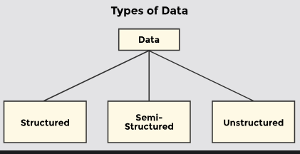
Unstructured: video, audio
Structured data: sql, 
Semi-Structured: 
dbms

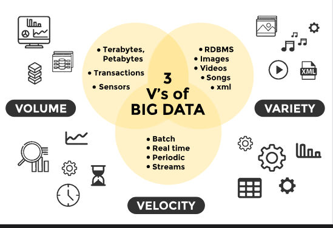
big data
data warehouse
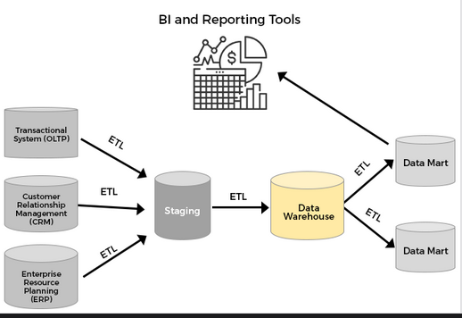
# Hadoop
Apache Hadoop là một framework mã nguồn mở nhằm mục đích giúp tương tác với dữ liệu lớn dễ dàng hơn.

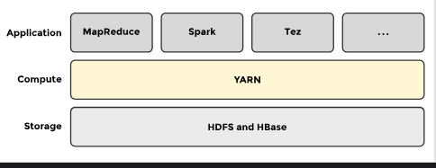

Hadoop Ecosystem là một platform hoặc một bộ cung cấp các dịch vụ khác nhau để giải quyết các vấn đề về dữ liệu lớn. Có bốn thành phần chính của Hadoop là HDFS, MapReduce, YARN và Hadoop Common Utilities .
- HDFS: Hadoop Distributed File System
- YARN: Yet Another Resource Negotiator
- MapReduce: Programming based Data Processing
- Spark: In-Memory data processing
## 1. Yarn

Chức năng cơ bản:
- Quản lý các tài nguyên của cluster
- Lập lịch và điều phối job
Các thành phần chính của YARN:
- Resource Manager
    + Applicatiob Manager
    + Scheduler: 
- Node Manager
### 1.1 ResourceManager
ResourceManager có nhiệm vụ quản lý toàn bộ tài nguyên trong cụm, nó cung cấp tài nguyên là core, RAM cho ứng dụng cần dùng, đồng thời cũng là đầu não quản lý các NodeManager. Trong một namespace chỉ có một active ResourceManger tại một thời điểm.

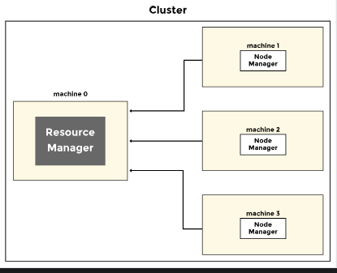

ResourceManager có hai thành phần chính là Scheduler và ApplicationManager.
- Scheduler: có nhiệm vụ cung cấp tài nguyên cho các ứng dụng sử dụng, nó là thuần scheduler và không có nhiệm vụ quản lý hay theo dõi tình trạng của ứng dụng, hoặc như việc restart các task bị fail. Việc cung cấp tài nguyên là dựa trên yêu cầu cảu ứng dụng, các tài nguyên như RAM, core,.. Việc này cũng dựa trên các chính sách chia nhỏ tài nguyên thành các queue, các chính sách như CapacityScheduler và FairScheduler.
- ApplicationManager:  Có nhiệm vụ tiếp nhận các job từ client, cấp phát tài nguyên để start ApplicationMaster cho từng ứng dụng, đồng thời cung cấp dịch vụ restart ApplicationMaster trong trường hợp lỗi.
### 1.2 Node Manager
NodeManager được cài trên 1 node có nhiệm vụ quản lý tài nguyên (RAM, core...) và job trên node đó. NodeManager thường xuyên gửi heartbeat đến RM thông báo tình trạng, mục đích chính của NM là quản lý các container mà RM giao cho nó, kill các container này nếu RM yêu cầu.

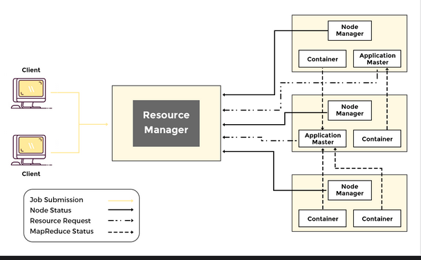

ApplicationMaster là một container được khởi tạo bới RM, tương ứng với mỗi job submit lên RM là một ApplicationMaster. AppMaster có nhiệm vụ điều phối các hoạt động của một job trong cụm, xin cấp phát tài nguyên từ ResourceManager và kết nối với NodeManger để quản lý các container.

Container là tiến trình của YARN, tập hợp các tài nguyên vật lý như core, RAM. YARN container được quản lý bới đối tượng Container Launch Context, đối tượng này lưu trữ các thông tin như biến môi trường, dependencies, security tokens và các chỉ thị để tạo tiến trình. Container cấp quyền cho các ứng dụng chạy trên nó sử dụng một lượng tài nguyên nhất định.

### 1.3 Workflow

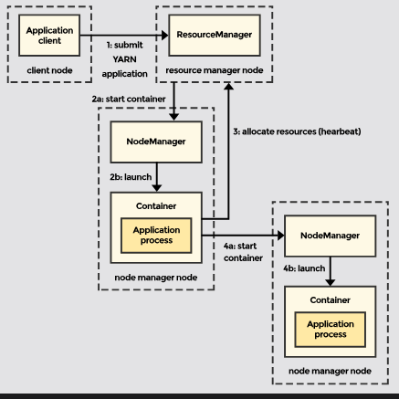

1. Client submit job đến ResourceManager bao gồm các bước, tài nguyên cần thiết để khởi tạo ApplicationMaster.
2. ResourceManager cấp phát tài nguyên và start ApplicationMaster.
3. AppMaster đăng ký với ResourceManager cho phép client giao tiếp trực tiếp đến AppMaster.
4. AppMaster sau đó request tài nguyên container từ ResourceManager.
5. Sau khi xin được tài nguyên từ RM, AppMaster cung cấp cho NodeManager chỉ dẫn để khởi tạo các container trên NM đó. Các container sau đó giao tiếp trực tiếp với AppMaster.
6. Việc thực thi job trên container báo cáo lại tiến độ công việc cho AppMaster.
7. Trong khi chương trình thực thi, client giao tiếp trực tiếp với AppMaster để nhận thông tin về tình trạng cung như cập nhật tiến độ công việc.
8. Khi chương trình hoàn tất, AppMaster ngắt kết nối với ResourceManger và off các containers.

Ứng dụng YARN chạy có thể vài giây đến vài ngày. Jobs to applications mapping:
- One job per application: mô hình đơn giản nhất
- Several jobs per application: thích hợp cho chạy một vài jobs như một workflow hay trong một phiên người dùng. Lợi ích là container có thể được tái sử dụng giữa các job và dữ liệu trung gian giữa các job có thể được cache trong bộ nhớ.
- Perpetually running application: Trong mô hình này, một ứng dụng đóng vai trò như một điều phối viên tiếp tục chạy, thậm chí mãi mãi và được chia sẻ giữa nhiều người dùng. Apache Slider và Impala là hai ứng dụng sử dụng chiến lược này. Trong trường hợp Apache Slider, một application master chạy lâu khởi chạy các ứng dụng khác trên cụm. Một application master luôn hoạt động giúp giảm độ trễ để thực thi một job vì chi phí khởi động một application master bị loại bỏ.

#### 1.3.1 MapReduce1
phiên bản đầu tiên của Hadoop, được gọi là MapReduce1 (MR1). MR1 không có YARN, chỉ thực hiện các MapReduce jobs.
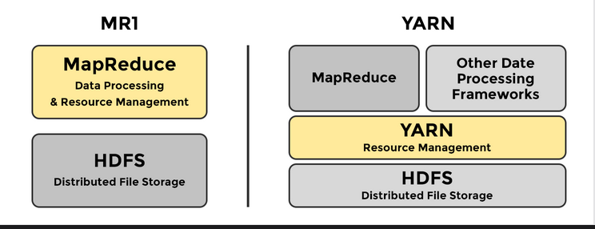
MR1 có hai luồng daemon quản lý thực thi jobs
- JobTracker: chịu trách nhiệm điều phối việc thực thi tất cả các job được gửi đến cluster
- TaskTracker: hạy các task và báo cáo tiến độ cho JobTracker.

MR1 là phiên bản đầu tiên của Hadoop, chỉ hỗ trợ MapReduce và gặp nhiều hạn chế về khả năng mở rộng và hiệu suất do thiết kế tập trung. YARN là kiến trúc kế thừa giải quyết các vấn đề của MR1 bằng cách tách biệt các chức năng và cải thiện khả năng sử dụng tài nguyên. YARN cho phép chạy nhiều loại ứng dụng phân tán, không chỉ giới hạn ở MapReduce
#### 1.3.2 Horizontal vs Vertical Scaling

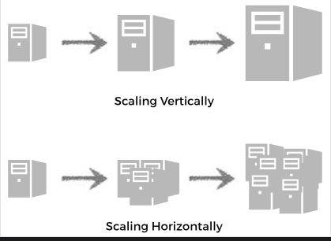

Horizontal Scaling: mở rộng bằng cách thêm nhiều máy vào nhóm tài nguyên.
Vertical Scaling: mở rộng bằng cách thêm power (CPU, RAM) vào một máy hiện có.
### 1.4 Scheduler


Tùy thuộc vào nhu cầu sử dụng mà YARN scheduler cung cấp các policies khác nhau. Hiện nay YARN hỗ trợ ba policies chính là:
- FIFO Scheduler
- Capacity Scheduler
- Fair Scheduler
#### 1.4.1 FIFO Scheduler

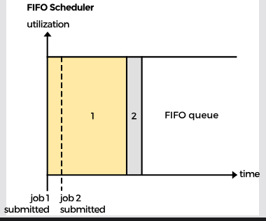


Job1 được submit trước và ngay lập tức chạy luôn, đồng thời chiếm toàn bộ tài nguyên của cụm, job2 submit ngay sau đó nhưng nó phải chờ đến khi job1 chạy xong thì mới có tài nguyên để chạy. Điều này khó có thể áp dụng trong thực tế, đối với các cụm dữ liệu lớn chia sẻ tài nguyên.
#### 1.4.2 Capacity Scheduler
Capacity Scheduler chia tài nguyên trong YARN thành các queue, ứng dụng sẽ submit job lên các queue này trong YARN, các queue sẽ được cấu hình một lượng tài nguyên nhất định và có thể sử dụng nhiều hơn up-to max cấu hình nếu có nhiều tài nguyên đang free.

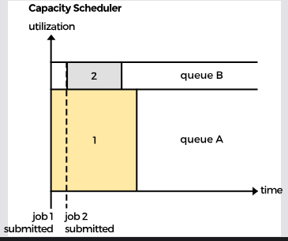

Hai queue A và B, có 2 job submit tương ứng, và chạy ngay khi được submit, điều này khắc phục tồn tại ở FIFO Scheduler, các job có thể chạy song song đồng thời, cả job lớn lẫn job nhỏ.  Tuy nhiên chúng ta sẽ phải cân đối tài nguyên giữa các queue, phân chia hợp lý để đảm bảo các queue đủ tài nguyên chạy job của mình, vì tài nguyên là hữu hạn nên khi tăng queue này đồng nghĩa với việc phải giảm tài nguyên của queue khác.

Vì thực tế có thể tại một thời điểm một queue dùng nhiều hơn lượng tài nguyên được cấp phát (có nhiều job lớn, dữ liệu về nhiều,…) nên Capacity Scheduler có cấu hình min và max capacity cho một queue, min là lượng tài nguyên đảm bảo chắc chắn queue này được có, max là lượng tài nguyên queue có thể tăng thêm trong trường hợp các queue khác không sử dụng đến. Tổng cấu hình min capacity của các queue là 100% tài nguyên cụm.
Việc submit job vào một queue cụ thể là do cấu hình ứng dụng, ví dụ như nếu dùng spark application thì tham số `spark.yarn.queue=queueA` chỉ ra rằng ứng dụng sẽ được submit vào queueA, nếu không xác định thì mặc định ứng dụng được submit vào queue default. Capacity Scheduler cũng hỗ trợ việc kiểm soát người dùng có thể submit job lên một queue với tham số `yarn.scheduler.capacity.root.<queue-path>.acl_submit_applications` . Khi submit ứng dụng lên YARN thì tên ứng dụng hay tên user submit ứng dụng cũng có thể dùng để xác định queue cho ứng dụng này, cấu hình ở `yarn.scheduler.capacity.queue-mappings` và `yarn.scheduler.queue-placement-rules.app-name` .


#### 1.4.3 Fair Scheduler
Nếu như Capacity Scheduler yêu cầu bạn phải dự trữ trước 1 lượng tài nguyên cho các queue thì Fair Scheduler không như vậy. Fair Scheduler sẽ tự động cân bằng tài nguyên giữa các queue running. Nếu job đầu tiên submit, nó sẽ chiếm toàn bộ tài nguyên trong cụm, đến khi có job 2 submit, tài nguyên sẽ dần cân bằng lại 50% giữa 2 queue.

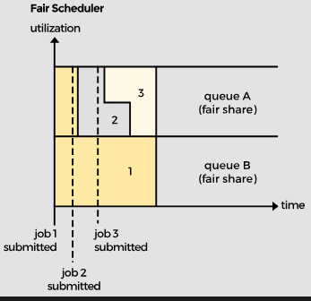

Hai queue là queue A và queue B cấu hình 50% tài nguyên cụm, sử dụng fair scheduler. Job 1 đầu tiên được submit vào queue A và sử dụng toàn bộ tài nguyên trong cụm, sau đó job 2 submit vào queue B, lúc này job 1 đang chạy chiếm full tài nguyên cụm, YARN sẽ phải chờ đến khi một số container nhỏ của job1 finished rồi cấp container free đó cho job 2 chạy. Sau một khoảng thời gian thì job 1 và job 2 đều chiếm 50% tài nguyên cụm, tương ứng full tài nguyên của queue A và B. Tiếp đó job 3 được submit lên queue B, lúc này job 3 cũng chờ job 2 free tài nguyên để sử dụng, sau đó job 2 và 3 chia nhau 50% tài nguyên của queueB.
Cơ chế Fair Scheduler cho phép các queue đều được chia sẻ tài nguyên một cách công bằng, các queue running luôn được cấp tài nguyên đảm bảo theo như cấu hình nhỏ nhất. Các queue đều có thuộc tính weights, ví dụ queue A và queue B ở trên có tỉ lệ là 50:50 nếu như weights không được xác định từ đầu, weight chỉ ra tương quan tỷ lệ tài nguyên giữa các queue chứ không phải là tỷ lệ phần trăm, nếu queue A có weight là 2 và queue B có weight 3 thì tỷ lệ tài nguyên sử dụng đồng thời giữa 2 queue là 2:3.

Đối với Fair Scheduler, khi có một ứng dụng mới được submit, việc chọn queue tuân theo chính sách queuePlacementPolicy. Ví dụ:
```

<queuePlacementPolicy>
 <rule name="specified" />
 <rule name="user" />
 </queuePlacementPolicy>
```
Đối với chính sách này, khi một ứng dụng submit job lên nếu không xác định queue thì mặc định sẽ được đưa vào queue trùng với tên user submit job, nếu queue này không tồn tại thì sẽ được tạo mới. Ngoài ra nếu muốn tất cả ứng dụng đều chạy trên một queue default thì cấu hình sau: `yarn.scheduler.fair.user-as-default-queue` về false, nếu không muốn user có thể tự tạo queue khi submit job thì cấu hình `yarn.scheduler.fair.allow-undeclared-pools` về false.

## 2. Map Reduce
### 2.1. Map and Reduce
MapReduce là một mô hình lập trình được sử dụng để xử lý các tập dữ liệu lớn trên một cụm các máy bằng cách sử dụng một thuật toán phân tán.


Nói một cách đơn giản MapReduce tương tự như thuật toán chia để trị. Một tập dữ liệu khổng lồ được chia nhỏ giữa các máy worker. Sau khi xử lý hoàn tất, dữ liệu từ mỗi máy được tổng hợp để tạo ra giải pháp cuối cùng. Data flow trong các giai đoạn khác nhau của một job MapReduce:

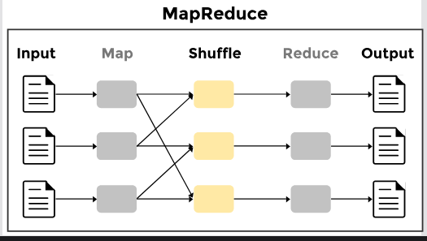

MapReduce về cơ bản là một hệ thống xử lý batch và không phù hợp cho phân tích tương tác, không thể chạy một truy vấn và nhận kết quả nhanh chóng. 

Mô hình bao gồm hai giai đoạn:
- Map phase: Người dùng chỉ định một hàm map xử lý một cặp khóa/giá trị để tạo ra một tập hợp các cặp khóa/giá trị trung gian.
- Reduce phase : Giai đoạn reduce hợp nhất tất cả các giá trị trung gian liên kết với cùng một khóa trung gian.

### 2.2. Đặc điểm
Mô hình lập trình MapReduce có các đặc điểm sau:
- Phân tán: MapReduce là một khung phân tán bao gồm các cụm phần cứng hàng hóa chạy các tác vụ map hoặc reduce.
- Song song: Các tác vụ map và reduce luôn hoạt động song song.
- Khả năng chịu lỗi: Nếu bất kỳ tác vụ nào thất bại, nó sẽ được lập lịch lại trên một node khác.
- Khả mở rộng: Nó có thể mở rộng tùy ý. Khi vấn đề trở nên lớn hơn, nhiều máy có thể được thêm vào để giải quyết vấn đề trong một khoảng thời gian hợp lý; khung có thể mở rộng theo chiều ngang hơn là chiều dọc.

Đầu vào và đầu ra
### 2.3 Input and Output
Framewwork độc quyền với các cặp khóa-giá trị. Đầu vào và đầu ra của cả hai giai đoạn map và reduce bao gồm các cặp khóa-giá trị. Tuy nhiên, các hạn chế sau áp dụng cho đầu vào và đầu ra:
- Serializable: Khung yêu cầu cả khóa và giá trị phải có thể tuần tự hóa và phảiimplement giao diện Writeable.
- Comparable: Framework sắp xếp đầu ra của giai đoạn map trước khi đưa nó vào giai đoạn reduce. Sắp xếp yêu cầu các khóa có thể so sánh với nhau và do đó được yêu cầu implement  giao diện WritableComparable.

### 2.4. Map phase

Maps là các tác vụ riêng lẻ chuyển đổi các bản ghi đầu vào thành các bản ghi trung gian. Các bản ghi trung gian được chuyển đổi không cần phải cùng loại với các bản ghi đầu vào. Một cặp khóa/giá trị đầu vào nhất định có thể ánh xạ thành không hoặc nhiều cặp đầu ra.

### 2.5. Reduce phase

Tập hợp các giá trị khóa trung gian được xuất ra bởi giai đoạn map được giảm xuống thành một tập hợp các cặp khóa giá trị nhỏ hơn bởi các reducer.


