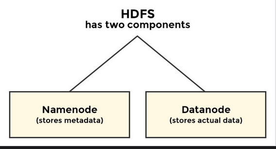
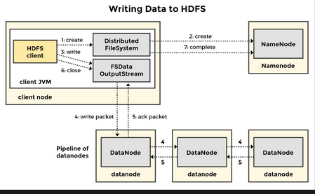
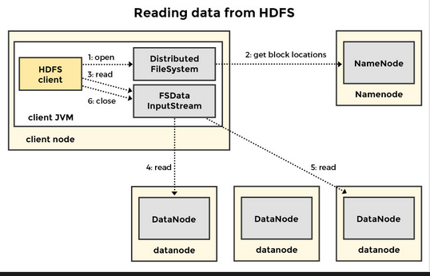
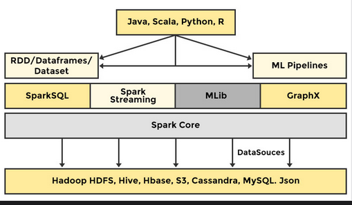
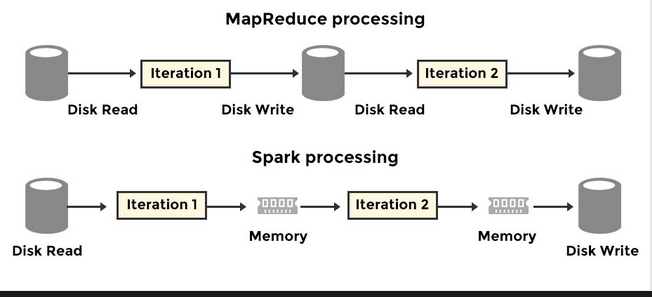
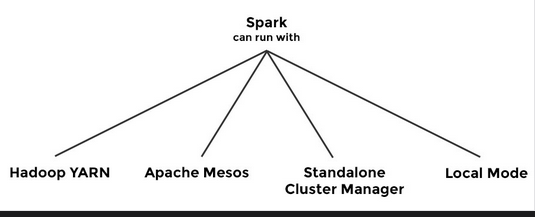
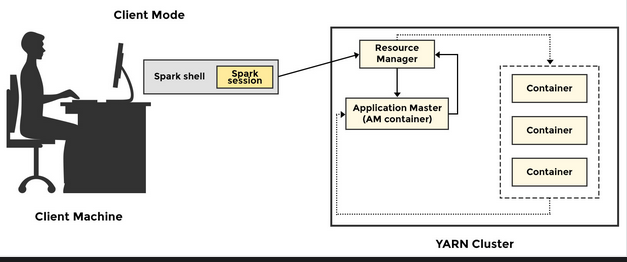
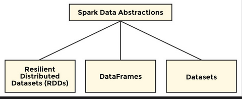
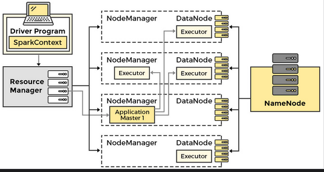
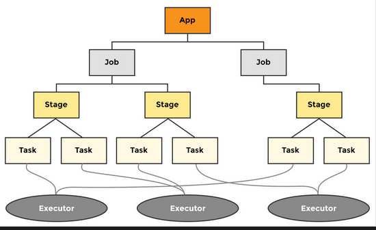

## 3. HDFS
### 3.1. Filesystem
Là một cơ chế để lưu trữ, tổ chức và truy xuất dữ liệu trên một phương tiện lưu trữ. 

OS file system : macOS của Apple sử dụng APFS (Apple File System) , Windows hỗ trợ  FAT, các biến thể của nó và NTFS, và Linux hỗ trợ họ filesystem EXT.

distributed file systems(DFS) sử dụng mạng để gửi/nhận dữ liệu và tạo ra ảo giác về một filesystem cục bộ cho các máy khách. Truy cập tệp được cung cấp từ nhiều máy chủ. Các tệp có thể được lưu trữ trên một máy chủ trung tâm hoặc trên nhiều máy chủ. 
ví dụ: Lustre, Google File System (GFS) và Andrew File System.

disk block: đơn vị nhỏ nhất cho đọc ghi 

file metadata: tên tệp, chủ sở hữu, điều khiển truy cập bảo mật, ngày sửa đổi cuối cùng, thời gian tạo và kích thước.

i-node : lưu metadata , chứa thông tin địa chỉ vật lí này lưu data gì (map physical -> logical )


### 3.2. Architecture


Mục đích:
- Large files: hệ thống lưu trữ các file lớn chứa hàng trăm gigabytes hay petabytes
- Streaming data access: HDFS được tối ưu và xấy dựng để write-once and read-many-times .
- Commodity hardware: được thiết kế để chạy trên các clusters với phần cứng hàng hóa giá rẻ, không yêu cầu phần cứng chuyên dụng đắt tiền.
  


Component
- Namenode (NN): kiểm soát quyền truy cập của máy khách vào tệp và lưu trữ metadat 
- Datanode (DN): lưu trữ data thực tế.

Mối quan hệ giữa Namenode và Datanode là master and slaves

HDFS không phù hợp cho:
- Truy cập dữ liệu độ trễ thấp: HDFS không được thiết kế để truy cập dữ liệu với độ trễ thấp trong phạm vi hàng chục mili giây. HDFS được tối ưu hóa để cung cấp thông lượng dữ liệu cao, có thể là với chi phí của độ trễ. HDFS được thiết kế để phục vụ các kịch bản xử lý hàng loạt thay vì các trường hợp sử dụng tương tác. HDFS nới lỏng ngữ nghĩa POSIX trong một số lĩnh vực chính để đổi lấy tăng thông lượng dữ liệu.
- Nhiều tệp nhỏ: Namenode giữ metadata trong bộ nhớ. Điều này giới hạn số lượng tệp trong hệ thống theo lượng bộ nhớ khả dụng trên Namenode. 

### 3.3 HDFS Blocks


HDFS không phải là một filesystem vật lý, mà là một sự trừu tượng hóa ảo trên các filesystem dựa trên đĩa phân tán. HDFS không thể được duyệt như filesystem cục bộ ---> shell HDFS, giao diện web HDFS hoặc API.

Một tệp trong HDFS được chia theo lôgic thành các khối HDFS.


HDFS Blocks của một tệp đơn có thể trải rộng trên các máy khác nhau trong cụm. 


HDFS có kích thước khối mặc định lớn.
- Giảm áp lực bộ nhớ trên Namenode: Namenode phải ghi nhớ tất cả các khối HDFS cho một tệp và giữ thông tin này trong bộ nhớ. 

- Giảm thời gian tìm kiếm: Một lý do khác để có kích thước khối HDFS lớn là để lấn át thời gian cần thiết để tìm kiếm đến đầu khối so với thời gian cần thiết để chuyển dữ liệu.  với tốc độ truyền dữ liệu, thì chúng ta có thể bỏ qua thời gian tìm kiếm và nói rằng dữ liệu được đọc ở tốc độ truyền dữ liệu của đĩa. 
- Cải thiện thông lượng mạng: Khi chạy MapReduce, có thể di chuyển dữ liệu từ nút này sang nút khác trên mạng. Các khối HDFS (chỉ là các tệp như chúng ta sẽ tìm hiểu sau) được truyền qua một kết nối TCP liên tục cho mỗi khối. Đối với kích thước khối lớn, kết nối TCP có thể đạt được thông lượng cao hơn so với kích thước khối nhỏ hơn. Khi làm việc trên một khối HDFS có kích thước lớn hơn, khả năng một máy khách thực hiện các hoạt động trên cùng một khối dữ liệu là cao. Do đó, nó có thể duy trì một kết nối TCP liên tục với Datanode và giảm chi phí mạng.
- Cải thiện hiệu suất MapReduce: Nếu kích thước chia nhỏ và kích thước khối HDFS bằng với số lượng bộ map được sinh ra trong một công việc MapReduce, để xử lý một tệp đầu vào bằng với số lượng khối HDFS trong tệp đó. Nếu kích thước khối quá nhỏ, nó sẽ dẫn đến quá nhiều bộ map với ít việc phải làm và quản lý chi phí bổ sung. Mặt khác, kích thước khối không nên quá lớn, dẫn đến quá ít tác vụ bản đồ và tăng thời gian thực hiện công việc.

### 3.4 Block Replication


Mấu chốt đằng sau khả năng chịu được dữ liệu bị hỏng hoặc mất của HDFS là việc sao chép các khối dữ liệu. Nếu một tệp bao gồm 4 khối HDFS và hệ số sao chép là 3, thì mỗi khối dữ liệu sẽ có 3 bản sao của chính nó. Những bản sao này được phân tán trong cụm trên các máy vật lý riêng biệt, tổng cộng là 12 khối. 
Sao chép đảm bảo rằng nếu một khối dữ liệu bị hỏng hoặc lỗi phần cứng xảy ra, thì yêu cầu đọc vẫn có thể được đáp ứng bởi một bản sao khả dụng khác của khối. Thiết lập này cho phép tự phục hồi. Một khối bị mất do hỏng hóc hoặc lỗi máy có thể được sao chép sang các máy trực tiếp khác bằng cách tạo một bản sao của bản sao khỏe mạnh. Hệ số sao chép được điều khiển bởi thuộc tính dfs.replication. 

### 3.5 Namenode

Namenode lưu trữ filesystem tree và các metadata cho các tệp và thư mục trong cây. 
Filesytem metadata được lưu dựa trên các thuộc tính:
- Namespace Image File
   FS Image là một snapshot(ảnh chụp nhanh) của filesystem metadata  tại một thời điểm nhất định. Nó là checkpoint của metadata của filesystem. Mỗi sửa đổi đối với filesystem được gán một ID giao dịch duy nhất, tăng dần đơn điệu. Tệp FS Image đại diện cho trạng thái của filesystem sau tất cả các sửa đổi cho đến một ID giao dịch cụ thể. 
- Edit Log
    EditLog là một nhật ký giao dịch hoặc nhật ký chứa các bản ghi cho mọi thay đổi xảy ra đối với metadata của filesystem sau FS Image gần nhất.
Cả FS image và edit log đều nằm trên filesystem cục bộ của NameNode.


#### 3.5.1 Cách hoạt động của Namenode

Một tệp trong hệ thống bao gồm một số khối. Các khối tạo thành một tệp không nằm trên cùng một Datanode mà thay vào đó được phân bố trên các Datanode khác nhau. Tại thời điểm khởi động, Namenode không biết vị trí của các khối dữ liệu của tệp. Nó xây dựng một bản đồ chứa vị trí của mỗi khối dữ liệu của mọi tệp từ các báo cáo định kỳ được gửi bởi Datanode. Mỗi Datanode xác định các bản sao khối trong sở hữu của nó với NameNode, bằng cách gửi một báo cáo khối. Namenode tính toán động bản đồ khối từ các báo cáo và duy trì nó trong bộ nhớ.

Khi Namenode khởi động, nó chọn FS Image và áp dụng edit log để có được trạng thái mới nhất của metadata filesystem. Tiếp theo, Namenode ghi trạng thái HDFS mới vào FS Image và bắt đầu hoạt động bình thường với một tệp chỉnh sửa trống. Thời gian khởi động tỷ lệ thuận với kích thước của edit log. Điều này có thể gây ra vấn đề. Một edit log khổng lồ mất nhiều thời gian hơn để xử lý, do đó làm tăng thời gian khởi động cho Namenode. Namenode chỉ hợp nhất FS Image và edit log khi nó khởi động. Điều này có thể khiến edit log phát triển theo kích thước tùy ý theo thời gian. Để giảm thiểu vấn đề này, Hadoop có thể chạy một Secondary Namenode, được mô tả tiếp theo.

#### 3.5.2 Secondary Namenode
Secondary Namenode không phải là Namenode dự phòng.

Secondary Namenode định kỳ hợp nhất edit log với FS Image để edit log không phát triển vượt quá giới hạn hợp lý. Secondary Namenode là trợ lý cho Namenode chính nhưng không thể thay thế nó trong trường hợp lỗi. Thông thường Secondary Namenode được chạy trên một máy khác vì nó yêu cầu tài nguyên máy tính và bộ nhớ tương tự như chính Namenode. 


#### 3.5.3 Giải quyết lỗi Namenode
Với tầm quan trọng của Namenode, điều bắt buộc là phải làm cho nó có khả năng phục hồi lỗi. Có ba chiến lược được sử dụng để làm như vậy:

* Sử dụng backups
    Sao lưu các tệp metadata, đặc biệt là tệp Namespace Image và tệp edit log tạo nên trạng thái metadata của filesystem
* Sử dụng Secondary Namenode
    Chạy một Secondary Namenode. Một Secondary Namenode duy trì một bản sao của FS Image, nhưng trạng thái của nó thường chậm hơn so với trạng thái chính. Trong trường hợp lỗi hoàn toàn của chính, mất dữ liệu là điều chắc chắn. Trong trường hợp đó, biện pháp khắc phục là sao chép các tệp metadata được sao lưu sang thư mục phụ và chạy nó dưới dạng chính.
* Sử dụng Standby Namenode
#### 3.5.3 High availability 
##### 3.5.3.1 Standby Namenode
- Trong trường hợp NameNode hay máy chủ cài đặt bị lỗi bất ngờ thì mọi hoạt động trong cụm sẽ dừng lại, không thể đọc ghi dữ liệu được nữa.
- Nếu muốn nâng cấp hệ thống, phần cứng hoặc phần mềm trên máy chủ cài NameNode thì hệ thống cũng sẽ bị downtime.

NameNode High Availability đã ra đời, theo đó trong cụm sẽ tồn tại 2 NameNode chạy đồng thời, 1 Active và 1 là Standby cho phép tăng khả năng chịu lỗi.

Tại một thời điểm chỉ có một Active NameNode, NameNode này chịu trách nhiệm cho toàn bộ operations trong cụm và update metadata, Standby NameNode có nhiệm vụ đồng bộ metadata với Active NamNode, đảm bảo có thể thay thế vị trí của Active trong trường hợp NameNode này bị crash.

Để thực hiện việc đồng bộ metadata giữa các NameNode, cả Active và Standby NameNode giao tiếp với một cụm Quorum Jounal Node (QJM) gồm nhiều Journal Node. Các hoạt động của client đều được Active NameNode cập nhật lại và ghi xuống editLogs ở các Journal Node, Standby NameNode sẽ đọc các thay đổi này và cập nhật metadata mới nhất

Số lượng Journal Node trong một Quorum phải là số lẻ 3, 5 hoặc 7. Vì Active NameNode cần ghi xuống các Journal Node này và nếu có vấn đề gì với dữ liệu, các Journal Node sẽ vote với nhau tìm ra phiên bản chiếm đa số vote là dữ liệu đúng. Với việc sử dụng nhiều Journal Node cũng tránh việc biến nó trở thành điểm chết.

Tại một thời điểm Journal Node chỉ cho phép một NameNode được quyền ghi, đó là Active NameNode, còn lại StandBy NameNode chỉ được quyền đọc. Các DataNode kết nối đến cả 2 NameNode và đồng thời báo cáo tình trạng cũng như thông tin block đến 2 NameNode
##### 3.5.3.2 Zookeeper
Việc implements automatic failover của NameNode dựa trên các lợi ích sau của Zookeeper:
- Failure detection: cả 2 NameNode đều giữ một session trong Zookeeper. Nếu một Active NN fail, session này sẽ hết hạn và failover xảy ra.
- Active NameNode election: Zookeeper cung cấp một cơ chế đơn giản cho việc chọn Active NN, nếu Active NN crash, Standby NN sẽ chiếm một lock đặc biệt trong Zookeeper ám chỉ nó sẽ là Active NN tiếp theo.
### 3.6 Datanode
Datanode lưu trữ data thật sự. Nó lưu trữ các data block và gửi báo báo tới Namenode.

### 3.7 Đoc/ghi

#### 3.7.1 Quá trình ghi



Quá trình ghi bắt đầu khi một client khởi tạo quá trình. Client có thể là một ứng dụng sử dụng API Java hoặc một người làm việc với tiện ích dòng lệnh hdfs. Luồng tương tác giữa client và HDFS diễn ra như sau:

* Client buffer data trên đĩa cục bộ ban đầu. Nó đợi cho đến khi một khối HDFS tích lũy dữ liệu trước khi liên hệ với Namenode.
* Namenode, khi được client liên hệ, sẽ xác minh xem tệp đã tồn tại chưa và client có quyền cần thiết để tạo tệp đó hay không. Nếu các kiểm tra này vượt qua, Namenode sẽ thực hiện thay đổi tương ứng trong namespace của nó. Sau đó, nó trả về cho client một danh sách các Datanode để ghi. Các Datanode này lưu trữ các khối (và bản sao của chúng) tạo nên tệp.
* Khi nhận được danh sách từ Namenode, client bắt đầu ghi vào Datanode đầu tiên.
* Datanode đầu tiên nhận dữ liệu từ client theo từng phần. Nó nhận phần đầu tiên, ghi nó vào kho lưu trữ cục bộ của mình, sau đó bắt đầu chuyển phần đó đến Datanode thứ hai trong danh sách.
* Datanode thứ hai nhận dữ liệu từ Datanode thứ nhất, ghi vào kho lưu trữ cục bộ của mình và bắt đầu chuyển phần đó đến Datanode thứ ba trong danh sách.
* Một pipeline truyền dữ liệu được hình thành từ client đến tất cả các Datanode liên quan. Một Datanode có thể đồng thời nhận và truyền dữ liệu.

#### 3.7.2 Quá trình đọc



- Đọc bắt đầu khi một client thực hiện cuộc gọi RPC đến Namenode để lấy vị trí của một vài khối đầu tiên của một tệp mà client muốn đọc.
- Namenode trả lời với một danh sách các địa chỉ Datanode cho mỗi khối được yêu cầu. Danh sách trả về cho mỗi khối bao gồm các Datanode có một bản sao của khối. Danh sách các Datanode được sắp xếp theo khoảng cách gần với client. Nếu client, giống như một tác vụ Map, chạy trên một Datanode cũng lưu trữ một bản sao của khối dữ liệu, thì bản sao cục bộ của khối được đọc.
- Nếu không có bản sao cục bộ của khối dữ liệu hoặc client đang chạy bên ngoài cụm, thì client kết nối với Datanode gần nhất để lấy khối đầu tiên trong tệp. Dữ liệu được truyền từ Datanode đến client cho đến khi kết thúc khối.
- Quá trình được lặp lại. Client kết nối với Datanode gần nhất để lấy khối dữ liệu tiếp theo. Các khối tệp được đọc theo thứ tự.
- Sau khi batch of data block đầu tiên được đọc, client yêu cầu Namenode lấy batch of data block tiếp theo và đọc chúng theo cùng một cách.
- Toàn bộ trải nghiệm cho ứng dụng client là liền mạch. Từ quan điểm của nó, ứng dụng client đang đọc một luồng liên tục.
- Lưu ý rằng theo client, chúng tôi muốn nói đến một ứng dụng như một chương trình gọi nội bộ các API Java được cung cấp bởi Hadoop để giao tiếp với HDFS. Người dùng không chịu trách nhiệm thực hiện các cuộc gọi mạng đến Namenode hoặc sắp xếp danh sách các Datanode theo khoảng cách ít nhất đến client. Thư viện Hadoop ẩn đi sự phức tạp này đối với người dùng. Dưới mui xe, các lớp Java cụ thể chịu trách nhiệm thực hiện các bước khác nhau được mô tả. Chúng tôi đã bỏ qua việc đặt tên cho chúng để giữ cho lời giải thích đơn giản.
- Nếu xảy ra lỗi khi giao tiếp với một Datanode, Datanode gần nhất tiếp theo lưu trữ bản sao của khối dữ liệu được thử. Datanode bị lỗi được ghi nhớ để nó không lấy bất kỳ khối nào trong tương lai.
Các khối nhận được được kiểm tra lỗi bằng cách tính toán tổng kiểm tra của chúng. Nếu tổng kiểm tra không khớp, một bản sao của cùng một khối được đọc từ một Datanode khác. Namenode cũng được thông báo về khối bị hỏng để thực hiện hành động khắc phục.
Lưu ý rằng Namenode chỉ chịu trách nhiệm phục vụ các yêu cầu về vị trí Datanode. Các khối dữ liệu thực tế không bao giờ được định tuyến thông qua Namenode đến client. Một khi client nhận được địa chỉ của các Datanode, nó nói chuyện trực tiếp với một trong các Datanode để lấy một khối mà không cần liên quan đến Namenode. Điều này ngăn Namenode trở thành điểm nghẽn và cho phép HDFS mở rộng quy mô lên một số lượng lớn client.


## 4. Spark
### 4.1 Giới thiệu về Spark



Spark là một nền tảng phổ biến cho xử lý dữ liệu và đã thay thế khung MapReduce truyền thống.

Sự khác biệt với MapReduce
* **Công việc lặp lại:** Một số thuật toán học máy thực hiện nhiều lần trên một bộ dữ liệu để tính toán kết quả. Mỗi lần lặp có thể được biểu diễn dưới dạng một công việc MapReduce riêng biệt. Tuy nhiên, mỗi công việc đọc dữ liệu đầu vào từ đĩa và sau đó đổ đầu ra của nó ra đĩa để công việc tiếp theo đọc. Khi liên quan đến I/O đĩa, thời gian thực hiện công việc tăng lên nhiều lần so với cùng một dữ liệu được truy cập từ bộ nhớ chính.
* **Phân tích tương tác:** Người dùng có thể chạy các truy vấn SQL ad-hoc trên các bộ dữ liệu lớn bằng cách sử dụng các công cụ như Hive hoặc Pig. Nếu người dùng đưa ra nhiều truy vấn nhắm vào cùng một bộ dữ liệu, mỗi truy vấn có thể chuyển thành một công việc MapReduce, đọc cùng một bộ dữ liệu từ đĩa và hoạt động trên nó. Nhiều công việc MapReduce đọc cùng một bộ dữ liệu từ đĩa là không hiệu quả và làm tăng độ trễ thực thi truy vấn.
* **API phong phú:** Spark, bằng cách cung cấp nhiều API phong phú, có thể biểu đạt ngắn gọn một hoạt động nếu không sẽ bao gồm nhiều dòng mã khi được biểu diễn trong MapReduce. Trải nghiệm của người dùng và nhà phát triển tương đối đơn giản hơn khi làm việc với Spark so với MapReduce.

Spark giữ lại nhiều tính năng của MapReduce như khả năng chịu lỗi, locality-aware scheduling và cân bằng tải. Nhưng Spark nổi bật trong việc tái sử dụng dữ liệu hiệu quả bằng cách lưu trữ nó trong bộ nhớ trên toàn bộ cluster, tiết kiệm round-trips đến đĩa. Truy cập bộ nhớ luôn nhanh hơn truy cập đĩa.


### 4.2 Architecture


Spark là một khung xử lý dữ liệu song song phân tán và có nhiều điểm tương đồng với khung MapReduce truyền thống. Spark có cùng kiến trúc  master-slave  với MapReduce:
- Driver là tiến trình chính quản lý việc thực thi một công việc Spark. Nó chịu trách nhiệm duy trì trạng thái tổng thể của ứng dụng Spark, phản hồi chương trình hoặc đầu vào của người dùng và phân tích, phân phối và lập lịch công việc giữa các tiến trình executor. Tiến trình driver là trái tim của ứng dụng Spark và duy trì tất cả thông tin liên quan đến ứng dụng trong suốt vòng đời của ứng dụng.

- Executor là các tiến trình nô lệ thực thi mã được giao bởi tiến trình driver. Chúng báo cáo trạng thái của phép tính trên executor đó trở lại cho driver.

#### 4.2.1 Cluster manager

Một job MapReduce hoặc Spark chạy trên một cụm máy. Trình quản lý ứng dụng của MapReduce hoặc tiến trình Driver của Spark không có thẩm quyền hoặc khả năng phân bổ tài nguyên cụm để thực thi công việc. Một phần mềm khác quản lý các tài nguyên vật lý của cụm và phân xử chúng giữa các công việc, thường dựa trên chính sách do người dùng định nghĩa. Trình điều khiển Spark đàm phán tài nguyên với trình quản lý cụm để khởi chạy các tiến trình executor. YARN là một ví dụ về phần mềm quản lý cụm như vậy. Spark tương thích với các trình quản lý cụm sau:

* Hadoop YARN
* Apache Mesos
* Trình quản lý cụm độc lập tích hợp
* Kubernetes
* Chế độ cục bộ



#### 4.2.2 Execution modes


Spark có thể thực thi ở hai chế độ:

* **Chế độ cụm:** Trong chế độ cụm, người dùng gửi một ứng dụng Spark (tệp .jar Java, Python hoặc R script) đến trình quản lý cụm. Trình quản lý lần lượt sinh ra các tiến trình driver và executor trên các nút worker để thực thi công việc. Trong cài đặt này, cả driver và executor đều sống bên trong cụm.
  
* **Chế độ client:** Chế độ client tương tự như chế độ cụm, ngoại trừ việc tiến trình driver sống trên máy client được sử dụng để gửi công việc Spark bên ngoài cụm. Máy chủ chứa tiến trình driver không được đặt cùng vị trí trên cụm chạy các tiến trình executor. Máy client chịu trách nhiệm duy trì tiến trình driver, trong khi cụm chịu trách nhiệm duy trì các tiến trình executor.
  
### 4.3 Spark API
Spark cung cấp các API và trừu tượng dữ liệu giúp cải thiện đáng kể trải nghiệm của nhà phát triển. Spark cho phép xử lý dữ liệu phân tán thông qua các chuyển đổi hàm của các bộ sưu tập dữ liệu (RDD). API Spark giảm đáng kể kích thước của các chương trình so với các khung khác như MapReduce. Ba trừu tượng dữ liệu có sẵn trong Spark là:
- Resilient Distributed Datasets (RDD)
- DataFrames
- Datasets
  


DataFrames và Datasets thuộc về các API có cấu trúc cấp cao hơn trong khi RDD được gọi là API không cấu trúc hay cấp thấp.
#### 4.3.1 RDD(Resilient Distributed Dataset)

 Là một collection các đối tượng hoặc bản ghi chỉ đọc (bất biến), được phân chia trên cụm có thể được hoạt động song song. Một phân vùng có thể được tái tạo nếu nút lưu trữ gặp lỗi. RDD là một API cấp thấp; hai trừu tượng dữ liệu khác của Spark là DataFrames và Datasets được biên dịch thành một RDD. C.

RDD là một API cấp thấp và các tác giả của Spark khuyến cáo không nên làm việc trực tiếp với chúng trừ khi mục đích là thực hiện kiểm soát hạt mịn. Khi sử dụng RDD, bạn phải đánh đổi các tối ưu hóa và chức năng được xây dựng sẵn đi kèm với các API có cấu trúc như DataFrames và Datasets. Ví dụ: dữ liệu được nén và lưu trữ ở định dạng nhị phân được tối ưu hóa trong trường hợp các API có cấu trúc. Điều đó phải được thực hiện thủ công khi làm việc với RDD.

RDD viết tắt của Resilient Distributed Datasets. Hãy khám phá từng thuộc tính:

* **Resilient:** có nghĩa là một RDD có khả năng chịu lỗi và có thể tính toán lại các phân vùng bị mất hoặc bị hỏng do lỗi nút. Khả năng tự phục hồi này được thực hiện bằng cách sử dụng đồ thị dòng dõi RDD mà chúng ta sẽ đề cập sau. Một RDD nhớ cách nó đạt được trạng thái hiện tại và có thể truy ngược lại các bước để tính toán lại bất kỳ phân vùng bị mất nào.
* **Distributed:** có nghĩa là dữ liệu tạo thành một RDD được phân tán trên một cụm máy.
* **Datasets:** đề cập đến các biểu diễn của các bản ghi dữ liệu mà chúng tôi làm việc cùng. Dữ liệu bên ngoài có thể được tải bằng cách sử dụng nhiều nguồn khác nhau như tệp JSON, tệp CSV, tệp văn bản hoặc cơ sở dữ liệu thông qua JDBC.

RDD Spark có thể được lưu trong bộ nhớ cache và phân vùng thủ công. Lưu trong bộ nhớ cache rất hữu ích vì nó cho phép sử dụng lại RDD nhiều lần. Phân vùng thủ công giúp cân bằng các phân vùng chính xác. Tiếp theo, chúng ta sẽ chuyển sang mã và xem một vài ví dụ về tạo RDD.

***Tạo RDD từ local collection***
Tạo RDD từ collection có sẵn sử dụng phương thức `parallelize()` từ `SparkContext`
```
// Create a local list
val brands = List("Tesla", "Ford", "GM")

// Create a distributed dataset from the local list as an RDD
val brandsRDD = sc.parallelize(brands)
```
***Tạo RDD từ data source***
```
// Create a RDD by reading a file from the local filesystem
val data = sc.textFile("/DataJek/cars.data")

// Print the count of the number of records in the RDD in spark-shell console
data.count

```
***Tạo RDD từ DataFrames & Datasets***
```
val dataFrame = spark.range(100).toDF()

// Create a RDD from the DataFrame
val rdd = dataFrame.rdd

// Inspect the number of records in the rdd
rdd.count
```

```
// Start spark shell
spark-shell

// Create RDD from List
val brands = List("Tesla", "Ford", "GM")
val brandsRDD = sc.parallelize(brands)
brandsRDD.count


// Create RDD from files 
val data = sc.textFile("file:///DataJek/cars.data")
data.count

// Read the text file as a single record
val data = sc.wholeTextFiles("file:///DataJek/cars.data")
data.count

// Create RDD from Dataframe
val dataFrame = spark.range(100).toDF()
val rdd = dataFrame.rdd
rdd.count

```

#### 4.3.2  DataFramesDataset

DataFrame là Structured API phổ biến nhất. 
Nó đại diện cho một bảng với các hàng và cột. Mỗi cột có một kiểu được xác định được duy trì trong một schema. 

Một DataFrame được chia thành các phần nhỏ hơn được gọi là partitions(phân vùng). Một phân vùng là một collection các hàng từ DataFrame cha nằm trên một máy vật lý cụ thể trên cụm.

Một schema xác định tên cột và kiểu của một DataFrame. Một schema có thể được xác định thủ công hoặc đọc từ nguồn. Spark cho phép suy luận schema. Spark đọc một vài hàng và sau đó phân tích các kiểu trong các hàng đó để ánh xạ chúng với các kiểu Spark.

Spark sử dụng một công cụ gọi là ***Catalyst*** để duy trì thông tin kiểu. Các kiểu Spark ánh xạ với các kiểu tương ứng trong các ngôn ngữ được hỗ trợ (Java, Python, v.v.). Spark sẽ chuyển đổi một biểu thức được viết bằng một trong các ngôn ngữ được hỗ trợ thành một biểu diễn Catalyst tương đương cho cùng một kiểu. Công cụ Catalyst áp dụng một số tối ưu hóa và liên tục được cải thiện để thực hiện nhanh hơn.

***working with DataFrames***
```
// Start spark shell
spark-shell

// Read in data
val df = spark.read.option("inferSchema", true).option("header", false).text("file:///DataJek/cars.data")

// Examine schema
df.schema
```

#### 4.3.3 Dataset
Một Dataset là một collection các đối tượng strongly-typed, bất biến được map tới một relational schema. Datasets là một type-safe structured API có sẵn trong các ngôn ngữ được hỗ trợ bởi Spark là Java và Scala được gõ tĩnh.
Datasets không được hỗ trợ trong R và Python 

Datasets là có thể nhờ vào một tính năng gọi là encoder. Encoder chuyển đổi các kiểu JVM thành biểu diễn nội bộ (bảng) chuyên biệt của Spark SQL. Encoder là các trình tạo mã được tối ưu hóa cao, tạo ra bytecode tùy chỉnh để tuần tự hóa và giải tuần tự hóa dữ liệu của bạn. Encoder được yêu cầu bởi tất cả Datasets. Encoder ánh xạ kiểu cụ thể miền với biểu diễn nội bộ của Spark cho kiểu đó. Các kiểu cụ thể miền được biểu thị dưới dạng bean cho Java và các lớp case cho Scala. Biểu diễn bảng được lưu trữ bằng định dạng nhị phân Tungsten nội bộ của Spark, cho phép các hoạt động trên dữ liệu được tuần tự hóa và cải thiện việc sử dụng bộ nhớ. Trong khi đó, khi sử dụng API Dataset, Spark tạo ra mã tại thời gian chạy để tuần tự hóa một đối tượng Java thành một cấu trúc nhị phân nội bộ và ngược lại. Việc chuyển đổi này có thể ảnh hưởng nhỏ đến hiệu suất nhưng có một số lợi ích. Ví dụ: vì Spark hiểu cấu trúc dữ liệu trong Datasets, nó có thể tạo ra một bố cục tối ưu hơn trong bộ nhớ khi lưu trữ Datasets.

***Sự khác biệt với DataFrames***
 Datasets kiểm tra xem các kiểu có phù hợp với đặc tả tại thời gian biên dịch hay không. DataFrames không thực sự không được gõ kiểu vì các kiểu của chúng được duy trì bởi Spark, nhưng việc xác minh rằng các kiểu phù hợp với đặc tả trong schema được thực hiện tại thời gian chạy. Nói cách khác, DataFrames có thể được coi là Datasets của kiểu Row, là biểu diễn trong bộ nhớ được tối ưu hóa nội bộ của Spark để tính toán. 


Có vẻ như là thừa khi có Datasets khi chúng ta đã có DataFrames. Tuy nhiên, có một số trường hợp được giải quyết độc đáo bởi Datasets:
- Một số hoạt động không thể được biểu diễn bằng DataFrames, chỉ với Datasets.
- Muốn đảm bảo an toàn kiểu. Ví dụ: cố gắng nhân hai biến chuỗi trong code sẽ thất bại tại thời gian biên dịch, thay vì tại thời gian chạy. Ngoài ra, việc phát triển có thể hữu ích khi IDE và các công cụ khác có thể cung cấp hoàn thành tự động và các gợi ý khác khi các đối tượng được gõ chặt chẽ.
- Nếu tất cả dữ liệu và các chuyển đổi của bạn chấp nhận các lớp case (Scala), thì việc tái sử dụng chúng cho cả khối lượng công việc phân tán và cục bộ là rất đơn giản.

### 4.3 Running Spark applications


SparkSession là single-unified entry point để thao tác dữ liệu với Spark. Có một sự tương ứng một-một giữa một ứng dụng Spark và một SparkSession. Mỗi ứng dụng Spark được liên kết với một SparkSession. SparkSession có một trường khác: SparkContext đại diện cho kết nối với Cụm Spark. SparkContext có thể tạo RDD, bộ tích lũy, biến phát sóng và chạy code trên cluster. 

### 4.4 Spark application



Một Spark app bao gồm một hoặc một vài jobs. Một Spark job không giống như MapReduce, rộng hơn về phạm vi. Mỗi job được cấu tạo từ các đồ thị không co chu kỳ của stage. Một stage tương đương với một map hoặc một reduce phase trong MapReduce. Một stage được chia thành nhiều task bởi Spark runtime và thực thi song song trong partitions của RDD thông qua cluster. 

Một Spark app có thể chạy một hoặc nhiều Spark job song song. 

Transformations là cốt lõi của việc biểu diễn logic nghiệp vụ của bạn bằng Spark. Hãy nhớ rằng, Spark làm việc với các cấu trúc dữ liệu bất biến là RDD. Là bất biến có nghĩa là chúng ta không thể thay đổi RDD gốc. Nhưng chúng ta có thể tạo ra một RDD mới bằng cách áp dụng một phép biến đổi lên các phần tử của RDD hiện có. Tuy nhiên, các phép biến đổi được đánh giá lười biếng, có nghĩa là chúng không được thực hiện cho đến khi một action được thực hiện trên một RDD. Một action kích hoạt một phép tính trên một RDD và làm gì đó với kết quả. Không giống như một phép biến đổi, một action được đánh giá ngay lập tức. 
* **Narrow transformation:** là các phép biến đổi mà mỗi phân vùng đầu vào sẽ đóng góp cho chỉ một phân vùng đầu ra. Các hoạt động RDD như map, union và filter có thể hoạt động trên một phân vùng đơn lẻ và ánh xạ dữ liệu của phân vùng đó vào phân vùng kết quả duy nhất. Các hoạt động ánh xạ dữ liệu từ một phân vùng sang chính xác một phân vùng khác được gọi là các phép biến đổi hẹp. Các phép biến đổi hẹp không yêu cầu dữ liệu được hoán đổi giữa các phân vùng.
* **Wide transformation:** là các phép biến đổi mà các phân vùng đầu vào đóng góp cho một số phân vùng đầu ra. Bạn thường sẽ nghe chúng được gọi là một sự hoán đổi nơi Spark sẽ trao đổi các phân vùng trên toàn cụm. Các hoạt động RDD như groupByKey, distinct và join có thể yêu cầu ánh xạ dữ liệu trên các phân vùng trong một RDD mới. Các phép biến đổi ánh xạ dữ liệu từ một đến nhiều phân vùng được gọi là các phép biến đổi rộng. 

### 4.5 Scheduling 


