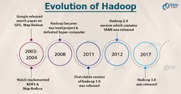
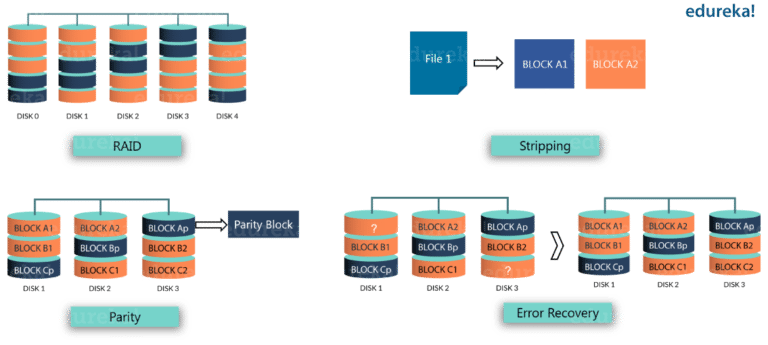
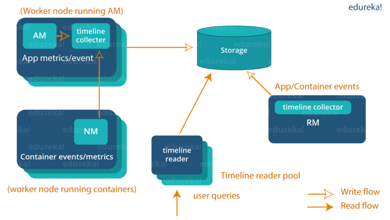
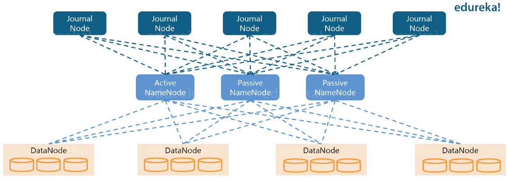
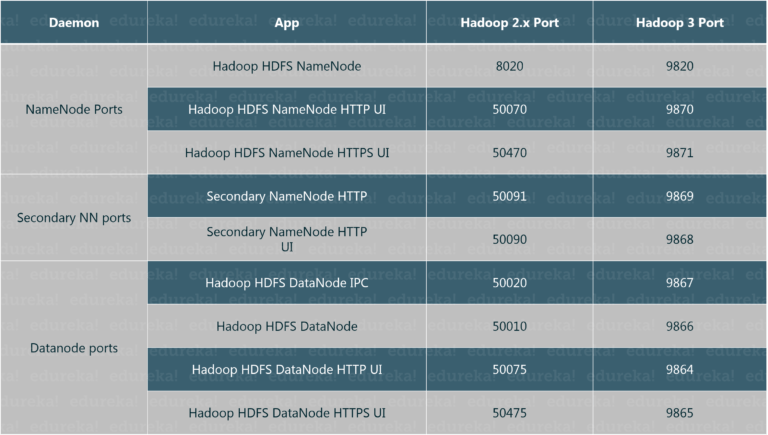
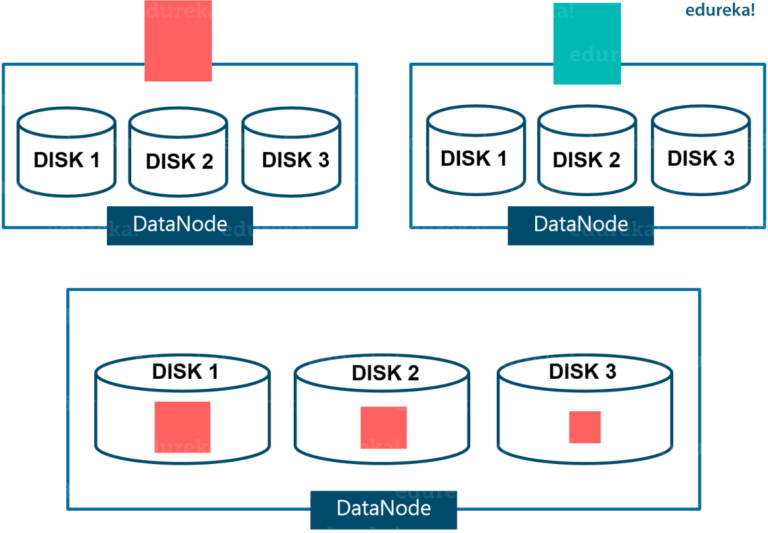
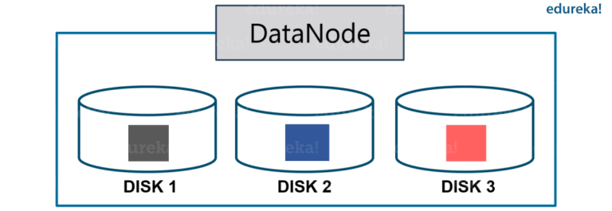

## Hadoop 2.x vs Hadoop 3.x

|            **Tính năng**            |                               **Hadoop 2.x**                               |                                   **Hadoop 3.x**                                  |
|:-----------------------------------:|:--------------------------------------------------------------------------:|:---------------------------------------------------------------------------------:|
| **Phiên bản Java tối thiểu hỗ trợ** | JAVA 7                                                                     | JAVA 8                                                                            |
| **Khả năng chịu lỗi**               | Chỉ sử dụng nhân bản dữ liệu (kém tối ưu dung lượng)                       | Sử dụng mã xoá phục hồi (tối ưu dung lượng)                                       |
| **Cân bằng dữ liệu**                | Sử dụng HDFS Balancer                                                      | Sử dụng Intra-data node balancer (gọi qua giao diện dòng lệnh HDFS disk-balancer) |
| **Kiểu lưu trữ**                    | Nhân bản dữ liệu 3 bản                                                     | Sử dụng mã xoá phục hồi trong HDFS                                                |
| **Tốn dung lượng lưu trữ**          | 200% dung lượng HDFS bị sử dụng                                            | 50% dung lượng HDFS  được sử dụng (cho phép lưu trữ nhiều dữ liệu hơn)            |
| **YARN Timeline Service**           | Sử dụng timeline service với hạn chế về khả năng mở rộng                   | Cải thiện timeline service, đồng thời nâng cao khả năng mở rộng và độ tin cậy     |
| **Khả năng mở rộng**                | Giới hạn, tối đa 10.000 node trong cụm                                     | Được cải thiện,có thể hỗ trợ nhiều hơn 10.000 node trong cụm                      |
| **Default Port (32768-61000)**      | Sử dụng dãy cổng tạm thời mặc định của Linux, có thể gây lỗi khi khởi động | Sử dụng dãy cổng ngoài dãy tạm thời này                                           |
| **Filesystem tương thích**          | HDFS (mặc định), FTP, Amazon S3 và Windows Azure Storage Blobs (WASB)      | Tất cả hệ thống file, bao gồm Microsoft Azure Data Lake filesystem                |
| **Namenode recovery**               | Yêu cầu can thiệp thủ công                                                 | Không cần can thiệp thủ công để phục hồi NameNode                                 |

### Erase Encoding trong HDFS

Thông thường, trong các hệ thống lưu trữ, Erasure Coding - EC chủ yếu được sử dụng trong Redundant Array of Inexpensive Disks (RAID).

RAID thực hiện EC thông qua phân vùng (striping), trong đó dữ liệu tuần tự logic (như một tệp) được chia thành các đơn vị nhỏ hơn (như bit, byte hoặc block) và lưu trữ các đơn vị liên tiếp trên các đĩa khác nhau. Sau đó, đối với mỗi dải các ô dữ liệu gốc, một số lượng nhất định các ô chẵn lẻ được tính toán và lưu trữ. Quá trình này được gọi là mã hóa. Lỗi trên bất kỳ ô phân vùng nào có thể được khôi phục thông qua tính toán giải mã dựa trên các ô dữ liệu còn sống và các ô chẵn lẻ.

Khi đã hiểu về Erase Encoding, bây giờ chúng ta hãy cùng xem xét kịch bản trước đó về nhân bản trong Hadoop 2.x. 
 
Replication factor mặc định trong HDFS là 3, trong đó một là khối dữ liệRu gốc và hai còn lại là bản sao yêu cầu 100% chi phí lưu trữ mỗi bản. Điều đó tạo ra 200% chi phí lưu trữ và tiêu tốn các tài nguyên khác như băng thông mạng.

có các dataset ít khi được truy cập nhưng vẫn tiêu tốn tài nguyên như các dataset

Erase Encoding lưu trữ dữ liệu và cung cấp khả năng chịu lỗi với chi phí lưu trữ thấp hơn so với nhân bản HDFS. Erase Encoding(EC) có thể được sử dụng thay thế cho nhân bản, cung cấp cùng mức độ khả năng chịu lỗi với chi phí lưu trữ thấp hơn. 

Tích hợp EC với HDFS có thể duy trì cùng mức độ khả năng chịu lỗi với hiệu quả lưu trữ được cải thiện. Ví dụ: một tệp được nhân bản 3 lần với 6 khối sẽ tiêu thụ 6*3 = 18 khối không gian đĩa. Nhưng với triển khai EC (6 dữ liệu, 3 chẵn lẻ), nó sẽ chỉ tiêu thụ 9 khối (6 khối dữ liệu + 3 khối chẵn lẻ) của không gian đĩa. Điều này chỉ yêu cầu chi phí lưu trữ lên đến 50%.

Vì Erase Encoding yêu cầu chi phí bổ sung trong việc tái tạo dữ liệu do thực hiện đọc từ xa, do đó nó thường được sử dụng để lưu trữ dữ liệu ít được truy cập. Trước khi triển khai mã xóa, người dùng nên xem xét tất cả các chi phí như lưu trữ, mạng và CPU của mã hóa xóa.

### YARN Timeline Service v.2

YARN Timeline Service v.2
- Cải thiện khả năng mở rộng và độ tin cậy của Dịch vụ Timeline
- Nâng cao khả năng sử dụng bằng cách giới thiệu luồng và tổng hợp 

### Hỗ trợ nhiều hơn 2 Namenodes
Trong Hadoop 2.x, kiến trúc khả dụng cao của HDFS NameNode có một NameNode hoạt động và một Standby NameNode. Bằng cách nhân bản các chỉnh sửa cho một quorum của ba JournalNode, kiến trúc này có thể chịu được lỗi của bất kỳ NameNode nào.

Tuy nhiên, các triển khai quan trọng đối với doanh nghiệp yêu cầu mức độ khả dụng lỗi cao hơn. Vì vậy, trong Hadoop 3 cho phép người dùng chạy nhiều Standby NameNode. Ví dụ: bằng cách cấu hình ba NameNode (1 hoạt động và 2 thụ động) và năm JournalNode, cụm có thể chịu được lỗi của hai node

### Default Ports 

### Intra-DataNode Balancer

Một DataNode duy nhất quản lý nhiều đĩa. Trong quá trình ghi thông thường, dữ liệu được chia đều và do đó, các đĩa được điền đều. Nhưng việc thêm hoặc thay thế đĩa dẫn đến sự lệch trong một DataNode. Tình huống này trước đây không được xử lý bởi bộ cân bằng HDFS hiện có. Điều này liên quan đến sự lệch nội bộ DataNode.

Giờ đây, Hadoop 3 xử lý tình huống này bằng chức năng cân bằng nội bộ DataNode mới, được gọi thông qua hdfs diskbalancer CLI.
